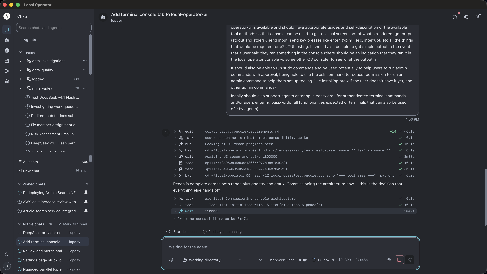
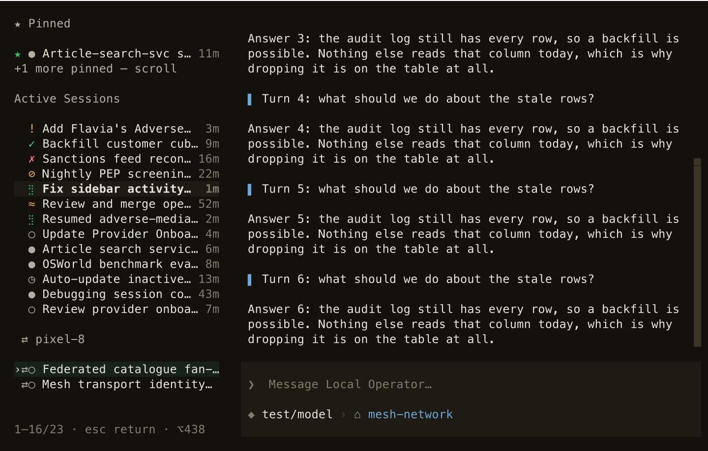
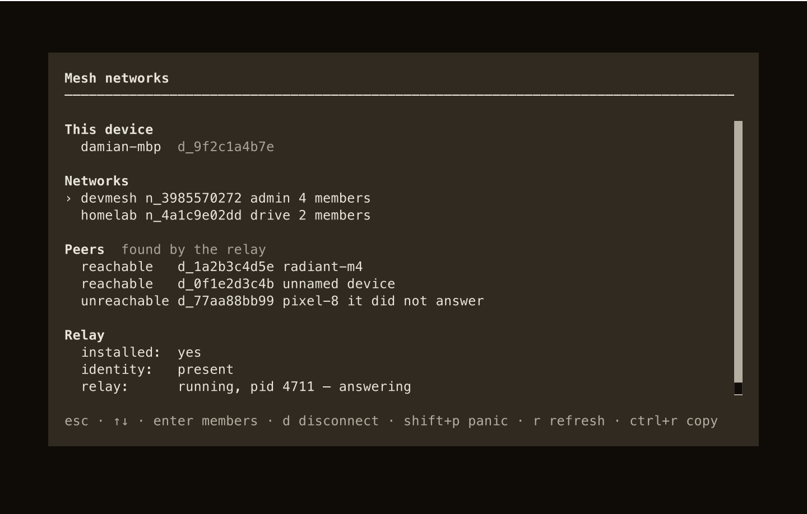

<picture>
  <source media="(prefers-color-scheme: dark)" srcset="./static/local-operator-icon-2-dark-clear.png">
  <source media="(prefers-color-scheme: light)" srcset="./static/local-operator-icon-2-light-clear.png">
  
</picture>

<h1 align="center">Local Operator</h1>
<div align="center">
  <h3>An open-source AI agent hub: build organizations of collaborating agents that run on your own machine, around the clock</h3>
  <p><i>Roles, teams, and cross-agent messaging on top of a fast terminal UI, using every AI subscription you already pay for</i></p>
</div>

<br />

<p align="center">
  
</p>

<p align="center"><i>A manager session with three workers running in the background (each with its own role, budget, and progress) while the shared plan updates.</i></p>

<br />

**Local Operator** is a harness for organizations of agents: the runtime
that hosts, supervises, and connects them. A single session plans its own
work, runs tools, browses, and remembers what it did. Give it a team and it
becomes a manager that delegates to tool-restricted workers, messages sibling
sessions in other repos, schedules its own follow-ups, and picks those
follow-ups back up after you close the terminal. Everything runs on your
machine, asks before it writes or executes, and is MIT licensed. It draws on
every ChatGPT, Claude, Kimi, Grok, Z.AI, and Qwen login you already have,
pooled, load-balanced, and used with the prompt cache in mind.

<div align="center">
  <a href="#-quickstart">Quickstart</a> •
  <a href="#-agent-organizations">Organizations</a> •
  <a href="#-subscriptions">Subscriptions</a> •
  <a href="#-always-on">Always On</a> •
  <a href="#-providers">Providers</a> •
  <a href="#-contributing">Contribute</a>
</div>

## 📚 Table of Contents

- [✨ Why Local Operator](#-why-local-operator)
- [🚀 Quickstart](#-quickstart)
- [🪟 Desktop App (local-operator-ui)](#-desktop-app-local-operator-ui)
- [🏢 Agent Organizations](#-agent-organizations)
- [🔁 Cross-Agent Communication](#-cross-agent-communication)
- [🛰️ Agent Mesh (your own devices)](#️-agent-mesh-your-own-devices)
- [🌙 Always On](#-always-on)
- [💳 Subscriptions](#-subscriptions)
- [🧮 Built for Token and Cache Efficiency](#-built-for-token-and-cache-efficiency)
- [🖥️ A Tour of the Terminal UI (TUI)](#️-a-tour-of-the-terminal-ui-tui)
  - [Slash commands](#slash-commands)
  - [Keys worth knowing](#keys-worth-knowing)
- [🔌 Providers](#-providers)
- [🧰 What the Agent Can Do](#-what-the-agent-can-do)
  - [🔎 Web search](#-web-search)
  - [🧠 Skills and guides](#-skills-and-guides)
  - [🔗 MCP servers](#-mcp-servers)
- [⚙️ Headless & Server Modes](#️-headless--server-modes)
- [📱 Phone Access (Mobile Relay)](#-phone-access-mobile-relay)
- [🌐 Drive Your Own Browser (Browser Extension)](#-drive-your-own-browser-browser-extension)
- [📦 Installation Options](#-installation-options)
- [🔧 Configuration & Credentials](#-configuration--credentials)
  - [Credentials and secrets](#credentials-and-secrets)
  - [What the agent's shell may see](#what-the-agents-shell-may-see)
  - [Standing instructions](#standing-instructions)
- [🌟 Radient: automatic model selection and agent sharing](#-radient-automatic-model-selection-and-agent-sharing)
- [🔒 Safety Model](#-safety-model)
- [📝 Examples](#-examples)
- [👥 Contributing](#-contributing)
- [🙏 Credits and Acknowledgements](#-credits-and-acknowledgements)
- [📜 License](#-license)

## ✨ Why Local Operator

- **Agent organizations with enforced roles.** Roles are capability
  boundaries (a `reviewer` loses the tools to edit what it reviews),
  specialists carry their own standing instructions, and a team is a saved
  roster (a manager plus members) with two short briefs: how the group works
  together and what product it owns. Reuse the same roster on a different
  product by swapping one brief. Nested teams show in the chart today; a
  manager delegating into a nested team's manager is coming.
- **Agents that talk to each other.** A manager peeks at, questions, steers,
  pauses, and resumes its workers through `hub`; independent sessions in
  different repos message each other with `send`, choosing whether to leave a
  note, wake an idle peer, or redirect one mid-turn. Loopback only, your OS
  account only.
- **Always on.** Wakes persist and fire on schedule even after the terminal is
  closed; long commands and subagents run as background jobs whose results
  auto-deliver when the session is idle; `lop exec --background` detaches a
  whole task; a paused worker resumes after a process restart; the mobile
  daemon keeps every session reachable from your phone.
- **Every subscription you already pay for.** Sign in to ChatGPT, Claude,
  Kimi, Grok, Z.AI, and Qwen with the accounts you already have. Have two
  Claude or ChatGPT accounts? They're pooled: new sessions start on the one
  with the most quota left, a rate-limit moves the request to the other, and
  only when both are exhausted does it fall back to the next model you've
  listed.
- **Cheaper long sessions.** The prompt is laid out so your provider's prompt
  cache keeps hitting turn after turn: stale tool output is cleared without
  invalidating the cache, large contexts automatically get the longer
  Anthropic cache window, skills and MCP tools load only when used, and
  agents wait for events instead of polling. The result: a long session
  doesn't re-pay for its history every few minutes.
- **Approval-gated by default.** Reads run; writes and shell commands show the
  exact command and ask. Opting out is an explicit act: `/approvals auto` or
  `--yolo`. Every tool call leaves a visible receipt in the transcript.
- **Reach beyond the terminal.** Watch and steer sessions from your phone,
  and drive the Chromium browser you already use, with your real logins,
  through the published browser extension. The
  [desktop app](#-desktop-app-local-operator-ui) puts the same sessions in a
  desktop window, with a browser pane, a file canvas, and — coming soon — a
  terminal agents can use.

## 🚀 Quickstart

Bring Python 3.12+ and one of: a provider login (see the [subscription
table](#-subscriptions) for the ids), an API key, or a local model server.

```bash
pip install local-operator     # pipx install local-operator on systems whose Python is externally managed (Debian/Ubuntu, Homebrew)
lop login anthropic            # opens your browser; paste the code back if asked. `lop login` lists providers
lop                            # start it, then type what you want done
```

`lop` is the short alias the install provides alongside `local-operator`; the
rest of this page uses it. `lop login <provider>` also sets that provider as
your default hosting and picks a default model when none is configured, so the
very next `lop` just works. Skip the login and an interactive `lop` opens in a
setup state and walks you through `/login`; a headless or piped run prints the
exact commands to configure hosting, model, and a key instead.

Inside, `esc` stops the agent, `/help` lists commands, `/exit` quits. Try
something like *summarize this repo and list what's untested*. `lop update`
upgrades the install from PyPI and restarts the mobile daemon when the
LaunchAgent is installed.

<p align="center">
  
</p>

Prefer a local model? A 7–14B model needs roughly 10–16 GB of RAM or VRAM.
Start [LM Studio](https://lmstudio.ai), load a chat model, and enable its
server in the Developer tab; then `/login lmstudio` inside Local Operator
picks the endpoint and model. `/login` also offers Ollama, vLLM, llama.cpp,
and a generic OpenAI-compatible server. See the
[local-provider guide](docs/LOCAL_PROVIDERS.md). The CLI form still works for
a model installed in [Ollama](https://ollama.com/download):

```bash
lop --hosting ollama --model qwen2.5:14b
```

## 🪟 Desktop App (local-operator-ui)

The terminal stays the core surface, and the rest of this page describes it.
The desktop app is the second way in: **Local Operator UI** is a desktop
application for macOS, Windows, and Linux that drives the same sessions, teams,
schedules, and configuration, and adds the surfaces a terminal cannot draw.

<p align="center">
  
</p>

<p align="center"><i>The desktop app on a real session: the sidebar, the transcript's tool receipts, two subagents running, and the composer's working directory, model, effort, context, and cost readouts.</i></p>

What the app adds:

- **A browser the agent can drive.** A Chromium pane with its own tabs and
  address bar lives inside the session window, with an approval prompt before
  the agent acts on a page, so a task can browse where you can watch it.
- **A file canvas and viewer.** Documents a session works on open beside the
  chat — markdown (with a WYSIWYG editor), code, HTML, images, PDFs,
  spreadsheets, audio, and video — instead of being printed into the
  transcript.
- **The same surfaces, as pages.** Agents, schedules, and settings are pages;
  teams are panels on the agents page — all reachable from a command palette,
  over the same configuration the TUI reads, with a built-in theme gallery.
- **A terminal agents can use — coming soon.** A per-session Console tab with
  real terminal emulation, which agents can open, read (stdout and stderr),
  capture visually, and type into. That is what makes end-to-end testing of
  interactive TUIs, and of other commands that need a live terminal, possible
  for an agent where `bash` alone cannot.

**Easiest install — the desktop build.** Download the installer for your
platform from the [downloads page](https://local-operator.com/download)
(macOS, Windows, and Linux, with the system requirements listed there). The app
bundles its own backend and installs it on first run, and uses an existing
Local Operator install when it finds one, so a separate `lop` install is
optional.

**Or install from a terminal** (Node.js 22.13.1 or newer):

```bash
npx local-operator-ui              # download and run in one command
npm install -g local-operator-ui   # or install it globally
local-operator-ui                  # ...then start it by name
```

Source, issues, and release notes live at
[damianvtran/local-operator-ui](https://github.com/damianvtran/local-operator-ui).

## 🏢 Agent Organizations

Three layers: subagents are the parallel workers, roles decide what each one
is allowed to touch, and a team is a saved roster you can point at a different
product.

**Subagents.** Ask for parallel work and the agent fans it out into concurrent
background workers, then keeps working while they run. The subagent dock shows
each worker's status, spend, and progress live, and you can open any of them to
read its transcript and plan (the reader's keys and limits are in
[docs/subagent-reader.md](./docs/subagent-reader.md)).

**Roles are capability boundaries.** A subagent launched as `reviewer` carries
vetted review guidance *and loses the tools to edit code*. It can read and run
tests, but it has no way to alter what it reviews. A restricted role cannot
enable new MCP tools either, and the restriction is inherited by everything
it delegates to, at any depth. Packaged starters for `reviewer`, `coder`,
`architect`, `manager`, `designer`, and `scout` ship in the package:
`task(agent=…)` and `/team` use them even on a fresh install, and
`agent install` copies one into your registry so you can edit it.
`lop agents list` shows what's installed, so a fresh install prints "No agents
found." You can also author your own **agent profiles**: reusable roles and
named specialists with their own instruction sets, matched to tasks by
semantic routing. When a profile gives bad guidance, you fix the profile once
instead of every prompt that uses it.

**Teams.** A saved roster (a manager plus members with counts) layered with
two briefs the individual agents never hard-code: a *collaboration* brief (how
this group works together, who blocks a release) and a *project* brief (what
product this instance owns). Swap the project brief and the same roster staffs
a different product. A roster slot can name another team (`team:<name>`), so a
team becomes an org of teams; `/team chart <name>` draws it as an org chart
(nested teams show as `(declared)` until a manager can actually delegate into
them). `lop teams list` is empty until you create one.

<p align="center">
  
</p>

<p align="center">
  
</p>

Sending a request to a team is one line: `/team <name> <request>` makes the
current agent that roster's manager, which breaks the work down and puts the
right roles on it. Agents and teams can also be managed from the CLI:

```bash
lop agents create "My Agent"
lop agents list
lop teams list
lop teams show lopdev
```

## 🔁 Cross-Agent Communication

Two shapes of conversation, one machine, no cloud in the middle.

**Down the tree.** Every worker a session spawns is addressable through `hub`:
`peek` reads the last few steps of its transcript without spending its
attention, `ask` poses a question and waits for the answer, `send` drops a
note, `steer` changes its course, `pause` stops it while keeping it resumable,
`cancel` ends it, and `resume` relaunches a stopped, paused, or settled child
against its own transcript, including after the parent process has restarted.

**Across sessions.** Two `lop` sessions you started yourself, in different
repos, with no parent between them and no shared context, can message each
other directly. One can tell another to hold off on a deploy, hand over a
finished branch, or claim a shared resource, without you relaying it between
terminals.

<p align="center">
  
</p>

<p align="center"><i>Two independent sessions negotiating a shared deploy slot. One claims it and asks for objections; the other checks its own in-flight work and clears it. No human in the loop.</i></p>

`lop sessions` is the directory of every session on the machine: state,
pid, kind, conversation, model, memory footprint, uptime, and heartbeat age
(`--json` adds `cwd` and `session_id`). From a shell you use `lop send`; from
inside a session the agent uses its own `send` tool, which lands as an
auditable card in its transcript. Both share the same three delivery modes
and differ only in the default: the CLI drops to the mailbox unless you ask
otherwise, while an agent's `send` wakes an idle peer. `--wake` starts a
turn if the target is idle; `--now` injects mid-turn to redirect a session
that is actively working. A running `bash`, `eval`, or MCP call is never cut
short, and a session parked in `wait` returns early to read the message.

```bash
lop sessions
lop send "release cutter" "gates are green, ready for review"
lop send "release cutter" --wake "the deploy finished; verify prod"
lop send "ingest refactor" --now "hold off, the schema changed"
lop send --pid 12345 "gates are green, ready for review"   # address by exact pid
git log -1 --stat | lop send "release cutter"      # body from stdin
```

Every delivery leaves a receipt on both ends: the target sees an inbound
`↔ peer message from "<conversation>" (pid N, <model>)` card, and the sender
gets back how the message landed. Targeting is a case-insensitive substring
over conversation name, session id, and cwd basename, and it refuses to guess:
an ambiguous match lists the candidates and exits non-zero rather than
delivering to the wrong session. The trust boundary is your OS account: every
session publishes a `0600` discovery record under a `0700` directory and
answers on an authenticated loopback server, so there is no remote or
cross-user path. The full targeting and refusal rules, the receipt strings,
and the limits (256 KB bodies; headless `exec` sessions may not receive) are
in the packaged [peer-messaging guide](./local_operator/guides/peer-messaging/GUIDE.md).

## 🛰️ Agent Mesh (your own devices)

`lop network` pairs your machines into a **mesh**: a group of devices that trust
each other by a shared secret, each with a keypair of its own. Pair once, and
the sessions running on those devices become one list you can read and act on
from any of them — the desktop you work at, the laptop upstairs, the small box
in the cupboard. Another device's sessions appear in the sidebar under their own
heading, marked `⇄`, and you can start, list, warm or stop a session on a peer
without leaving the machine you are sitting at.

The mesh is peer-to-peer: your devices dial each other directly, with no service
in the middle, and the relay that coordinates them runs on your own machine
(under a LaunchAgent on macOS). The trust boundary is the network itself — a
device you paired — and pairing is a single-use token plus a code two people
compare on two screens.

<p align="center">
  
</p>

<p align="center"><i>A device in a mesh: another machine's sessions carry the <code>⇄</code> mark and group under it, beside this device's own pinned and active sessions. Captured from a real two-device mesh — the rows come from the peer's own listing, over a live link, not from a fixture.</i></p>

<p align="center">
  
</p>

<p align="center"><i><code>/network</code>: this device, the networks it is in, which peers answer, and whether the relay is running.</i></p>

**Getting started.** On the device that should own the network:

```bash
lop network init devmesh                 # create the network, mint this device's identity, start the relay
lop network invite --role drive          # a single-use token, written to a file, never printed into a pipe
```

It prints where the token went; hand that file to the other device out of band
and, there:

```bash
lop network join @/path/to/token         # both devices show a code; a person compares them, then confirms
lop network status                       # installed, identity, relay, and this device's links
lop network ls                           # devmesh  n_2bf6b70bd36b1cca228daa9f  epoch 1  admin  1 member(s)  active
```

`invite --print` reads the token straight off a terminal when you would rather
copy it than move a file. Roles are `read`, `drive` and `admin`; a token can be
bound to one device and given a shorter life. The full walk-through — including
what to do when a device is unreachable, and the incident verbs (`panic`,
`disconnect`) — is in the packaged
[network guide](./local_operator/guides/network/GUIDE.md).

**From inside a session.** The mesh is a slash-command family, so you never
leave the composer:

```text
/network               this device's networks, peers and relay state, as a screen
/network peers         which devices answer right now
/network sessions --all-peers  what other devices are running: list, engage, stop
/network status        relay health and the log path
/network log           the recent mesh event trail
```

**Running a session on another device.** `/new remote` creates the session on
the peer, with a trailing sentence as its first prompt:

```text
/new remote radiant-m4 rebase the auth branch and run the test suite
```

The session is minted, spawned and admitted by that device, and the receipt in
your transcript names it. `/network sessions --peer radiant-m4` then lists what
that peer is holding, and `--engage <session>` warms one or `--stop <session>`
ends it — so a session started this way is visible and controllable from the
machine you are sitting at, without a second terminal.

**A note on what is not here yet.** A session stays where it runs. Creating,
listing, warming and stopping a session on a peer all work; *moving* a running
session from one device to another, and recalling a remote session back onto
this machine, are still being built —
[`docs/design/mesh-session-mobility.md`](./docs/design/mesh-session-mobility.md)
is that design. Nothing above documents a command that does not run today.

## 🌙 Always On

Work keeps moving after you walk away.

- **Scheduled wakes that survive a closed terminal.** The agent's `wake` tool
  schedules a future turn ("check the build again in 30 minutes"). Schedules
  persist with the session. On macOS a small **wake supervisor** (installed
  on demand as a LaunchAgent the first time a wake is scheduled) starts a
  runtime for whichever session's wake is due, so a wake fires even if you
  closed the terminal that scheduled it (a session that is still open fires
  its own). On Linux and Windows there is no supervisor: a wake fires the
  next time that session is running. If a wake fires unattended and a tool
  needs approval, the turn stalls at the prompt until you answer from the
  phone or `/resume`; `/approvals auto` or `--yolo` opts into unattended
  execution. A session that was asleep past a due time fires the wake late
  and reports how many occurrences it skipped, rather than replaying six
  hourly checks at once. `lop wake status` reports whether the supervisor is
  actually *running* (not merely installed), the soonest wake that will fire,
  and how many are overdue, dormant, too stale for the supervisor to keep
  retrying, or blocked by a wedged runtime holding the session lease; `lop
  wake list` shows every schedule with that state per row. When the supervisor
  has stopped or gone missing, `lop wake install` puts it back.
  Human-readable wake times use the machine's
  local timezone, labelled explicitly, with a 12-hour AM/PM clock by default.
  Other dates include the month/day (and year when different). Choose **Wake
  time format** in `/settings` → Appearance, or run
  `lop config edit display.time_format 24h` for a 24-hour clock (`12h` restores
  the default). This changes display only; stored timestamps and JSON output
  remain epoch milliseconds, and existing transcript confirmations are not rewritten.
- **Background jobs that report back on their own.** `task` always runs in
  the background and `bash` can (`background=true`); a long command
  interrupted by a steer detaches instead of dying; and every settled job
  auto-delivers its result when the session is idle. `jobs` peeks at new
  output since your last look.
- **`lop exec --background`** detaches a whole task with a log file and exits
  immediately.
- **Waiting without polling.** `wait` blocks up to 60 minutes and returns the
  moment a job settles, a message arrives (a peer's `send`, a wake, a
  subagent's `hub` note), or you steer. One sized wait replaces a chain of
  short polls that each re-send the whole context.
- **Resume after a restart.** Transcripts persist and `/resume` picks a
  session back up; a paused or settled subagent can be resumed with `hub
  op='resume'` after the parent process has restarted.
- **A daemon that keeps sessions reachable.** `lop mobile install` runs a
  supervised session daemon (LaunchAgent on macOS; on Linux and Windows the
  daemon is portable and foreground-runnable, with no installer yet); every
  interactive session registers with it, and you watch, steer, and start
  sessions from your phone. See [Phone Access](#-phone-access-mobile-relay).
  `lop update` restarts the daemon when the LaunchAgent is installed.

## 💳 Subscriptions

Sign in with the accounts you already have. `lop login` lists every
login-capable provider; the ids and plan requirements:

| You pay for | Type | Plan needed |
| --- | --- | --- |
| ChatGPT | `lop login openai` (`openai-device` on a headless box) | ChatGPT Plus/Pro |
| Claude | `lop login anthropic` | Claude Pro/Max |
| Kimi | `lop login kimi` | Kimi (Moonshot) |
| Grok | `lop login xai-oauth` (`xai` = API key) | Grok OAuth |
| Z.AI / GLM | `lop login zai-oauth` (`zai` = API key) | GLM Coding Plan |
| Qwen | `lop login alibaba-token-plan-oauth` | QwenCloud Token Plan (a personal plan also needs the [console ticket](./local_operator/guides/qwencloud/GUIDE.md) for `/usage`) |

OpenAI, Anthropic, Z.AI, and Qwen logins are keyed by account identity, so a
second login adds to the pool; Kimi holds one account (xAI identity is
best-effort). API keys and local servers sit alongside.

**What this means for you.** With one account per provider, Local Operator
uses that account's plan quota (no API bill) and, when it is rate-limited,
falls back to the next model you listed. With two or more accounts on the
same provider, it spreads your sessions across them so you hit the
5-hour/weekly limits later, and it deliberately does *not* hop accounts to
balance load mid-conversation, because each provider caches your conversation
per account and a hop would re-pay to rebuild it.

- **Accounts on one provider form a rotation pool.** New sessions start on
  the account with the most remaining quota, and concurrent sessions fan out
  across those accounts instead of herding onto one.
- **Failover follows a fixed order.** On a quota, auth, or 5xx failure the
  request rotates to a sibling account first. Only when the pool is spent
  does it walk your **model fallback chain** (`retry.fallbackChains` in
  `config.yml`), backing off between attempts. `/failovers` prints the
  cascade and marks which account is serving right now.
- **Cache-aware stickiness.** A session prefers the account it started on,
  because the provider's prompt cache is per account and moving would rewrite
  the whole conversation prefix at cache-write price. With the default
  config a quota, auth, or 5xx failure still rotates to a sibling; with
  `retry.usageAwareFallback: true` a low account is never an eviction; only
  a depleted one moves a running session.
- **Opt-in proactive switching.** `retry.usageAwareFallback` spends one
  lightweight quota request per user message to leave a provider *before* it
  fails, with `retry.usageReservePercent` (default 10) as the headroom floor.
- **Everything is visible in-app.** `/usage` shows each provider's quota
  windows and account spend; `/accounts` lists every signed-in provider account
  (the `lop secret` store is separate); `/session` reports the current session's
  cost, cache, and request
  diagnostics. One exception: QwenCloud's personal Token Plan window needs a
  [console ticket](./local_operator/guides/qwencloud/GUIDE.md) stored alongside
  the login.

<p align="center">
  
</p>

The packaged [failover guide](./local_operator/guides/failover/GUIDE.md)
explains the routing in full, including how to change the order.

## 🧮 Built for Token and Cache Efficiency

Long-running agents spend most of their tokens re-sending context, so the
harness treats the provider prompt cache as a resource to be managed:

- **A stable prefix.** The tools array is built in a deterministic order and
  rides in the same cache prefix as the system prompt, so the provider can
  reuse it turn after turn. Most extra capabilities live behind gated tools,
  skills, or MCP instead of sitting in every prompt.
- **Cache-aware pruning.** Superseded tool outputs (an older read of a file
  that was read again, a zero-match search) are blanked in place without
  forcing a cache rewrite. Once a session has idled past the cache TTL, the
  cache is provably cold and everything eligible flushes at once.
- **Automatic 1-hour cache TTL.** At or above 150k context tokens, Anthropic
  requests switch from the 5-minute to the 1-hour cache window; tunable via
  `providers.anthropic.cache_ttl_1h_min_context_tokens` (0 disables it).
- **Compaction before overflow.** Context compacts itself before the window
  fills; `/compact` runs it on demand and `/context` reports what is occupying
  the prefix right now.
- **Lazy everything else.** Skills are indexed semantically and their bodies
  load only when read; MCP servers advertise a bounded summary and individual
  tool schemas enter the context only when enabled; `wait` returns on job
  settle or message arrival so a long job costs one round trip, not twelve.

## 🖥️ A Tour of the Terminal UI (TUI)

The TUI is a full-screen [Textual](https://textual.textualize.io/) app, not a
REPL. Everything the agent does shows up as a card or a one-line receipt: tool
cards expand (`enter`/`space`) to show the full command and output, and the
status line tracks the current step, token usage, and cost. Inside a
terminal multiplexer (tmux, wezterm, [cmux](https://cmux.com/), and others),
`lop` publishes a per-pane crash-restore binding
([multiplexer-resume.md](./docs/multiplexer-resume.md)) and, in a
[Herdr](https://herdr.dev) Agents panel, reports whether it is idle, working,
or blocked ([herdr-agents.md](./docs/herdr-agents.md)).

<p align="center">
  
</p>

<p align="center"><i>One session mid-task: streamed responses, expandable tool cards, and one-line receipts for everything the agent does.</i></p>

When a tool call needs your sign-off, the approval prompt shows exactly what
is about to run before anything touches your system:

<p align="center">
  
</p>

Switching models goes through a picker rather than a config file. `/model`
lists every model your signed-in providers offer, with fuzzy filtering.
ChatGPT OAuth uses the account's supported maximum context by default while
keeping the provider default visible;
[context limits and the opt-out](docs/openai-context.md) explain how without
changing your compaction settings.

<p align="center">
  
</p>

Coming back later is `/resume`, a picker over your recent sessions, each
with its title and age:

<p align="center">
  
</p>

### Slash commands

`/help` shows the full table in-app. The highlights:

| Command | What it does |
| --- | --- |
| `/model` | Switch model for this session; `/model default` saves the current one for new ones, `/model saved` reverts to it (`/settings` edits the boot default too) |
| `/effort` | Show or set reasoning effort (`shift+tab` cycles; save a level for new conversations with `/model default`) |
| `/fast` | Toggle fast mode where the provider sells one: the same answer sooner, at premium pricing |
| `/approvals` | Set whether tools ask first (`ask`/`auto`; add `default` to keep it) |
| `/resume` | Pick a past conversation and continue it |
| `/new`, `/clear`, `/reload` | Fresh conversation · wipe the screen · relaunch this conversation on the current install |
| `/update` | Install the latest version from PyPI and relaunch |
| `/goal <text>` | Set the session objective and send the same text to start work; bare `/goal` shows it and `/goal --clear` clears it without starting a turn (`/goal clear`, `none` and `reset` still work) |
| `/loop` | Iterate autonomously toward the session objective: `/loop <n>` for a bounded count, `/loop <goal>` toward an inline goal; `/loop --stop` cancels a running one and `/loop --clear` clears it — which on a detached owner means dismissing a finished run's published state |
| `/btw` | Ask a side question off the record; it never joins the conversation |
| `/compact` | Compact the context now (it also happens automatically) |
| `/usage`, `/context` | Provider quota and account spend · what's occupying the context window |
| `/session` | Current-session recorded usage, combined cost, cache, and request diagnostics |
| `/failovers` | The model cascade for this session, and which account is serving |
| `/provider`, `/login`, `/logout`, `/accounts` | Manage providers and signed-in accounts |
| `/credential` | Hand over a secret: type it after `/credential` and a space to have it masked and captured; a paste your terminal delivers as text is captured the same way; the composer's own paste key (`Ctrl+V` on macOS) is not. Bare `/credential` lists this session's credentials, and `/credential --persist <KEY>` saves one to the long-term store. See [Credentials and secrets](#credentials-and-secrets) |
| `/search` | Configure web-search providers and load balancing |
| `/team` | Launch a saved team: `/team <name> <request>`; `/team chart <name>` draws its org chart |
| `/skills`, `/mcp` | List loaded skills · MCP servers |
| `/theme`, `/rename` | Pick from 20+ built-in themes (arrows preview live) · rename the session |

`/reload` and `/update` can replace the terminal while its detached session
runtime keeps working. The new terminal reattaches to the same saved conversation,
including streamed output and unanswered approval or ask prompts. The runtime
adopts installed code only when all work is safely idle: active turns, tools,
compaction, gates, loops, child agents, background jobs, and imminent wakes defer
that refresh. Reloading an unchanged build does not restart the runtime. Local
in-process work and terminal-owned `!` shell commands must finish first. A failed
update leaves the current terminal and runtime running.

### Keys worth knowing

- `$<skill>`: run a named skill on the rest of the line
  (`$research the payments rewrite`); `$` alone opens the picker.
- **Type while the agent works**: your message is delivered at the next
  step as steering, no need to wait.
- `esc` — stop the agent without ending the session.
- `ctrl+b` or `/sidebar` — show or hide active and recent conversations in the
  same TUI. `cmd+b` is also accepted when the terminal forwards the Super
  modifier. `/settings` → **Session sidebar** and **Sidebar position** control
  visibility and left/right placement; the defaults are hidden and left.
  `f9` or `/sidebar focus` opens and focuses the list without changing your
  draft. Arrow keys choose a row, Enter opens it, and Escape returns to the
  previous input surface. F9 also returns focus without hiding a pinned list.
  `ctrl+shift+↑` / `ctrl+shift+↓` switch straight to the previous/next
  conversation in the list's order without opening it, wrapping at the ends;
  the caret and your unsent draft stay where they were.
  On narrow terminals, selecting a conversation dismisses the overlay drawer.
- `f8` — open an aside (side question) without losing what you were typing;
  `ctrl+f` promotes the aside into the conversation.
- `shift+tab`: cycle reasoning effort.
- `ctrl+l`: clear the transcript (history is untouched).
- `ctrl+t` / `ctrl+g`: expand the todo list · cycle the subagent panel.
- **Hand over a secret**: `/credential` followed by a space opens a masked
  capture: type the value and **Enter** turns it into a chip, and a paste your
  terminal delivers as text (`Cmd+V` on macOS) is captured the same way. The
  composer's own paste key (`Ctrl+V` on macOS) never consults the capture: it
  reads the clipboard itself, so it inserts the value as ordinary text.
- `option+←` / `option+→` (`ctrl+←` / `ctrl+→` on Linux and Windows): move the
  caret a word at a time in the composer; add `shift` to select by word. Works
  the same in shell (`!`) mode and with a command list open, and `option+↑` /
  `option+↓` behave as plain `↑` / `↓`. On macOS this works whichever
  option-key mode your terminal is set to. The default, "Use Option as Meta",
  and "Esc+" all behave the same, so there is nothing to configure.

## 🔌 Providers

Every provider below runs on the same harness and the same model picker.
OAuth providers sign in through the browser and use your existing
subscription; API-key providers prompt once and store the key locally. Local
servers can be configured in the app with `/login`, including endpoints and
optional masked API tokens. See
[Local and self-hosted providers](docs/LOCAL_PROVIDERS.md) for setup,
metadata overrides, desktop-app support, and server-specific limitations.

| Provider | Access |
| --- | --- |
| OpenAI / ChatGPT | `openai` / `openai-device`, or `OPENAI_API_KEY` |
| Anthropic / Claude | `anthropic`, or `ANTHROPIC_API_KEY` |
| Kimi (Moonshot) | `kimi`, or `KIMI_API_KEY` |
| xAI / Grok | `xai-oauth`, or `xai` / `XAI_API_KEY` |
| Z.AI (GLM) | `zai-oauth`, or `zai` / `ZAI_API_KEY` |
| Qwen (Alibaba) | `alibaba-token-plan-oauth`, or API key |
| Google Gemini | `GOOGLE_AI_STUDIO_API_KEY` |
| DeepSeek | `DEEPSEEK_API_KEY` |
| Mistral | `MISTRAL_API_KEY` |
| OpenRouter | `OPENROUTER_API_KEY`: one key, many models |
| Radient | `RADIENT_API_KEY`: automatic per-step model selection |
| LM Studio, Ollama, vLLM, llama.cpp | User-operated server; optional token |
| OpenAI-compatible | Explicit server URL; optional token; MLX/LocalAI/proxy escape hatch |

```bash
lop login              # list login-capable providers
lop login openai       # OAuth flow; for OpenAI/Anthropic/Z.AI/Qwen, repeat to add a second account
lop login-status       # what's signed in
lop logout kimi
```

Legacy `--hosting <name> --model <name>` flags keep working, and API keys can
be stored with `lop credential update <KEY_NAME>` (a masked prompt); the
`lop secret` store, and the `/credential` hand-over that keeps a secret out of
the prompt text, are covered in
[Credentials and secrets](#credentials-and-secrets).

## 🧰 What the Agent Can Do

The agent's built-in tools, each with its own card in the transcript:

- **Run things**: `bash` (shell commands), `eval` (a persistent Python
  kernel: variables survive across calls).
- **Work with files**: `read`, `write`, `edit` (surgical search/replace),
  `glob`, `grep`, plus `lsp` for Jedi-backed Python code intelligence.
- **Reach the web**: load-balanced `web_search` across eight providers,
  `web_fetch` for reading pages headlessly, and a `browser` tool for pages
  that need rendering, a login, or interaction.
- **Stay organized**: a visible `todo` list for multi-step work, `ask` to
  put real decisions back to you as a picker instead of a wall of text.
- **Handle secrets**: the `secret` tool stores, lists, updates and removes
  entries in the encrypted long-term store, and hands a value to `bash` or
  `eval` without ever returning it to the model. See
  [Credentials and secrets](#credentials-and-secrets).
- **Run an organization**: `task` spawns subagents, `hub` talks to them,
  `jobs`/`wait` manage background work, `send` reaches other sessions,
  `agent` and `team` author profiles and rosters, and `wake` schedules future
  follow-ups.

### 🔎 Web search

Search works out of the box. The chain walks **free legs first and metered legs
last**: the free providers you list, then the credential-free providers this
install can reach, then the best-effort ones, then anything that would spend money
or a model turn — including a paid provider you listed, which is tried first among
the paid legs and never before a free one.

```bash
lop search list
lop search test "Python 3.13 release notes"
lop search enable perplexity          # clears an exclusion
lop search disable brave             # excludes it from every search
lop search order duckduckgo tavily   # the priority prefix: free legs first, paid ids run after them
lop search setup brave --api-key
lop search setup tavily --oauth      # official Tavily MCP server
lop search setup searxng --endpoint https://search.example.com
```

`web_search.providers` is a **priority prefix, not an allowlist**, and its
authority is over order **within a band**: a named free provider joins the free
pool where you put it — and with the default `round_robin` that pool is rotated, so
"where you put it" is its position in the pool rather than a promise it is tried
first on every call (`search balance ordered` is the strict version). Every other
usable provider joins automatically behind the ones you named.
`web_search.excluded_providers` is the only way to say never — an id there is
skipped in the prefix *and* in the automatic bands. A provider that becomes
usable mid-session (a DeepSeek login, an Exa key) joins its band on the next
search with no further configuration; `lop search list` states each provider's
state, so the chain is never a guess.

Listing a provider whose transport would **spend** — a key, or a model turn —
does not put it first. It moves it to the head of the **paid** band, so every
free leg is still tried before it: a paid provider listed ahead of a free one is
tried first *among the paid legs*, and `lop search list` names it as `paid` rather
than as a plain `enabled`. That keeps the free-before-paid rule absolute, and
`search list`'s `chain:` line shows the resulting order.

`round_robin` spreads the first attempt across the whole **free pool** — the
listed free providers in their listed order, then the credential-free providers
that joined automatically — and never across a band boundary, so nothing that
spends can be rotated (or listed) ahead of a free leg.

| Provider | Access | Default |
| --- | --- | --- |
| DuckDuckGo | Credential-free | Priority prefix |
| Tavily | Keyless, `TAVILY_API_KEY`, or OAuth MCP | Priority prefix (keyed: paid band) |
| Exa | Keyless MCP (no key needed), or `EXA_API_KEY` | Automatic (free; keyed: paid band) |
| Parallel | Keyless MCP (no key needed), or `PARALLEL_API_KEY` | Automatic (free; keyed: paid band) |
| Perplexity | Anonymous or `PERPLEXITY_API_KEY` | Automatic (best-effort; keyed: paid band) |
| DeepSeek | Model login or `DEEPSEEK_API_KEY` | Automatic (paid) |
| Brave | `BRAVE_API_KEY` | Automatic (paid) |
| SerpApi | `SERPAPI_API_KEY` | Automatic (paid) |
| SearXNG | Self-hosted endpoint URL | Automatic (free, with an endpoint) |

The same controls are available in-app via `/search`.

### 🧠 Skills and guides

Drop a `SKILL.md` (with optional reference files) into
`~/.local-operator/skills/<name>/` and the agent indexes it semantically.
Only the skills relevant to the current turn are surfaced, and their bodies
load on demand via `skill://<name>` reads, so your context isn't taxed by
knowledge you aren't using. `/skills` lists what's loaded.

You can also invoke one **by name** instead of leaving the choice to the
router: type `$` in the composer to pick from your skills, then write the
request: `$research compare these two API designs` loads that skill and
sends it with your message. A skill marked `hide: true` is excluded from
automatic routing and is reachable this way only, which makes `$` the home
for "never pick this on your own, but run it when I say so".

### 🔗 MCP servers

Local Operator speaks [MCP](https://modelcontextprotocol.io/) over the
official SDK, with lazy tool loading: servers advertise a bounded summary, and
individual tool schemas enter the context only when the agent actually enables
them.

```bash
lop mcp add linear --url https://mcp.linear.app/mcp --oauth
lop mcp login linear     # complete the OAuth flow
lop mcp list
```

Server configs are discovered from the project (`.local-operator/mcp.json`,
`.mcp.json`), your home directory, and best-effort imports of Claude Code,
Cursor, VS Code, and Codex CLI configs, so servers you already configured
elsewhere are available without re-declaring them. See
[docs/mcp.md](./docs/mcp.md) for the trust model before enabling
project-supplied servers.

## ⚙️ Headless & Server Modes

**Headless sessions** for scripts, saved teams and goal loops:

```bash
lop exec "summarize the failures in ./test.log"
lop exec "long migration" --background   # detach with a log file
lop exec "audit deps" --json             # one JSON line per event
lop exec "review the change" --team release --background
lop exec --goal "Finish the checklist" --loop 3
lop exec --status JOB_ID                 # durable outcome and session ID
lop --resume SESSION_ID                  # live TUI attachment or cold resume
```

Foreground exit code 0 means success, so `lop exec` composes in a pipeline.
Background launch prints a readiness receipt; use `--status` for the eventual
outcome. Saved teams, reusable profiles, goals and conversation names persist
with the ordinary session. Non-TTY approvals still deny unless explicitly
changed; `--control` opts into supervisor gates, not automatic approval.
See [the full exec guide](./docs/EXEC.md) for option combinations, stdin,
resume precedence, loop counting, approvals and lifecycle semantics.

**Server mode** exposes the agent as a FastAPI service (used by the optional
[desktop UI](https://github.com/damianvtran/local-operator-ui)):

```bash
pip install "local-operator[server]"
lop serve                 # http://127.0.0.1:1111, docs at /docs
```

The legacy HTTP API has no authentication and defaults to loopback. Keep it
away from untrusted clients; an explicit `--host` can widen the bind only when
you provide access controls in front. This is separate from the authenticated
mobile relay. See
[API filesystem boundaries](./docs/API_FILESYSTEM_BOUNDARIES.md) for
fresh-ID profile imports, workspace-confined edit reads and live editor
buffers.

## 📱 Phone Access (Mobile Relay)

`lop mobile` turns the machine you run agents on into a phone-facing control
plane for every `lop` session on it. A single supervised **session daemon**
owns the web surface, and every interactive TUI session registers with it
automatically over an authenticated loopback socket. From your phone you can
watch transcripts stream, steer a running turn, switch model and effort, run
slash commands, drill into subagents, and start brand-new sessions. Sessions
you start from the phone also answer their own approval and ask prompts there;
for a terminal session those prompts are still answered at the terminal (the
phone shows that it is waiting).

<p align="center">
  
</p>

<p align="center"><i>A live <code>lop</code> session driven from a phone: the same transcript, tool cards, and composer as the TUI.</i></p>

**You can ask Local Operator to set this up for you.** Tell the agent
something like *"set up phone access"* and it will walk through the install,
confirm the health check and the closed auth gate, and get you the portal
password through a channel you choose (or leave it in the Keychain for you to
retrieve). If you would rather do it by hand:

```bash
lop mobile install      # generate/keep the portal password, install the daemon, verify health
lop mobile status       # install state, health probe, and registered sessions
lop mobile password     # show or rotate the portal password
lop mobile logs -f      # follow the daemon's and the runtimes' logs
```

Once the daemon is up, every interactive `lop` you start publishes itself and
shows up in the phone list live. No extra flag per session.

### Additional setup is required for remote access

The daemon binds **loopback only** (`127.0.0.1:4098`) and never a wider
address. That keeps it private by construction, so reaching it from your
phone over the internet needs a secure path you put in front of it, together
with an identity proxy so only you can open it.

The **recommended method is a [Cloudflare Tunnel](https://developers.cloudflare.com/cloudflare-one/networks/connectors/cloudflare-tunnel/)**
with Cloudflare Access in front: the tunnel gives the daemon a public
hostname without opening a port on your machine, and Access enforces
sign-in before any request reaches loopback. A WireGuard-based mesh such as
[Tailscale](https://tailscale.com/) is a good alternative if you would rather
keep everything on a private network. Either way, do not change the bind
address to expose the daemon directly; put the tunnel and the identity proxy
in front of the loopback listener instead.

The portal itself is protected by a single password (Keychain-backed on
macOS, or `LOP_MOBILE_PASSWORD` for containers), and session cookies are
derived from it, so rotating the password invalidates every logged-in phone.

## 🌐 Drive Your Own Browser (Browser Extension)

The `browser` tool can drive a [cmux](https://cmux.com/) panel, a macOS
terminal built for running agents side by side. On any Chromium
browser (Chrome, Edge, Arc, Brave) the free **Local Operator browser extension**
gives the agent the same capability against the browser you already use, with
your real logins, entirely on your machine. A small loopback **bridge daemon**
connects the extension to your `lop` sessions; nothing leaves your computer, and
the agent can only open sites you approve.

**You can ask Local Operator to set this up for you**, or do it by hand:

```bash
lop browser install     # install and start the loopback bridge daemon
lop browser status      # daemon health, whether a browser is attached, pairing state
lop browser pair        # print the 6-digit code to type into the extension popup
```

Then install the extension from the
[Chrome Web Store](https://chromewebstore.google.com/detail/local-operator/omibaecbjdhgbbcedbnnnmjpmopfheof)
(or build it from `extension/` in this repo with `pnpm -C extension build` and
load `extension/dist` unpacked at `chrome://extensions` with Developer mode
on), click its toolbar icon, and enter the pairing code. Once paired, `browser`
tool calls drive a dedicated tab in your real browser. The first time the
agent wants a new site, the published store build asks **Allow
once**, **Always allow**, or **Deny**; you stay in control of which sites it
can reach, and can revoke the whole browser any time from the extension's
Settings or with `lop browser pair --reset`.

The bridge daemon binds **loopback only** and is pinned to your extension by the
pairing code; a compromised page cannot reach it, and a revoke drops any live
connection within seconds. Each store release is recorded in
[docs/store/release-record.md](./docs/store/release-record.md).

## 📦 Installation Options

The default install is deliberately small. Optional features live behind
extras:

| Extra | Adds |
| --- | --- |
| `server` | The HTTP API server (`lop serve`) and background scheduler |
| `mcp` | Model Context Protocol client support |
| `images` | HEIC/HEIF image attachment decoding |
| `tokenizer` | Exact BPE token counting (estimated otherwise) |
| `fetch` | Markdownify renderer for `web_fetch` |
| `lsp` | Jedi-backed symbol-aware Python navigation for the `lsp` tool |
| `all` | Everything above except `lsp` |

```bash
pip install "local-operator[all]"    # quote it, or your shell globs the brackets
```

If you hit a feature whose extra is missing, the agent tells you which one to
install instead of failing with an import error.

**Nix**: `nix develop` drops you into a reproducible dev shell via the
provided `flake.nix`.

**Docker**: `docker compose up -d` with the provided compose file.

## 🔧 Configuration & Credentials

Configuration lives at `~/.local-operator/config.yml`:

```bash
lop config create      # scaffold it
lop config list        # every option, with descriptions
lop config edit <key> <value>
lop config open        # open it in your editor
lop config instructions  # which instruction files a session assembles, in order
```

Commonly set values: `hosting`, `model_name` and `model_effort` (skip the CLI
flags; `model_effort` sets the reasoning level new conversations start at, and a
rung the chosen model lacks clamps to its nearest),
`conversation_length` / `detail_length` (history kept verbatim vs
summarized), `tui.theme` (any registered theme name, easier to set with
`/theme`, which previews live), and `retry.fallbackChains` (the model
cascade). See [Subscriptions](#-subscriptions). `bash.shell` picks the
interpreter the `bash` tool spawns: unset, it runs the first `bash` on `PATH`
(Homebrew bash 5 when installed, else the system one) and falls back to
`/bin/sh` only on a host with no bash, so process substitution and other bash
syntax work as the tool's name promises. Every option is browsable in
`/settings`.

### Credentials and secrets

Five different things get called "credentials" here, and they behave
differently. **Provider API keys** are the keys `lop` itself reads: they live
in `~/.local-operator/credentials.env` as plaintext, and you set them once
through a masked prompt. **Provider logins** are the OAuth tokens `lop login`
gets, stored in `~/.local-operator/auth.db`, where they refresh themselves. The
QwenCloud console ticket is one login you keep by hand (below).
**Session credentials** are what a secret handed over through the `/credential`
capture becomes: held in memory for that session, injected into every `bash`
child's environment so a command can use them, and never readable by the model.
**Ordinary variables** are the named values a session carries for the agent,
shared through the `list_variables` and `read_variable` tools; they are not
secret at all, and they are filtered against a list of names that must never be
passed on. The **encrypted long-term store** (`~/.local-operator/secrets/`) is
where a secret goes when it has to outlive the session, and it is the main
subject of this section.

`lop credential` stores provider API keys; `lop secret` stores every other
secret you save yourself, the QwenCloud ticket included.

```bash
lop credential update OPENROUTER_API_KEY    # provider key, masked prompt
lop credential delete OPENROUTER_API_KEY
```

**What the `lop secret` store is, and is not.** Secrets are encrypted with
AES-256-GCM under names the store keeps only as a keyed hash, so the store's own
directory holds no readable `.env`, no greppable `API_KEY=`, and not even the
secret names. That is a statement about the store alone: the provider keys above
are still a plaintext file.

In the default mode the master key is a file beside the store, so anyone who
copies that directory can decrypt it. Against an attacker who reads the key
file itself, that is the same bar as a plaintext `.env`. `lop secret harden`
moves the store to passphrase mode, where the only key on disk is a
passphrase-wrapped copy and the unwrapped master key lives in the memory of a
running broker; it is not the passphrase that stays in memory, and reading that
key from another process raises a macOS authorization prompt. Run
`lop secret unlock` once after each boot to put the key back in the broker.

What the store is **not** is a vault: `lop` is on your `PATH`, so anything
running as you that is willing to run `lop` can read every secret exactly as
the agent does, and a value an agent retrieves is in that session's memory for
the turn. `lop secret status` reports the mode, and the risk that comes with it
when the command can open the store: the key file itself in the default mode,
the unlocked broker's memory in passphrase mode. When it cannot open the store
it prints the reason and the command that fixes it, and no note. Neither mode
is a vault, and the limit above holds in both. The store raises the cost of
stealing these credentials a long way. It is not a guarantee.

**One provider login you keep by hand** is the QwenCloud console ticket: a
browser session cookie you capture and store yourself, expiring roughly weekly.
Its value goes into the encrypted `lop secret` store rather than into `auth.db`,
which keeps only the ticket's metadata: its name, when it was captured, and
its length. The
[QwenCloud guide](./local_operator/guides/qwencloud/GUIDE.md) covers it,
including `lop qwencloud-ticket migrate` for a ticket stored by an older build.

The `lop secret` commands are the main way in. Values are read from stdin,
never from the command line, where any process running as you can read them:

```bash
printf %s "$TOKEN" | lop secret set GITHUB_TOKEN --description "CI token"
lop secret list                     # names and descriptions, never values
lop secret get GITHUB_TOKEN         # value to stdout, no trailing newline
lop secret rm GITHUB_TOKEN
```

Use a stored secret in the command that needs it:

```bash
curl -H "Authorization: Bearer $(lop secret get GITHUB_TOKEN)" https://api.github.com/user
```

The value reaches `curl` inside the child process; the model sees only the
command text it wrote, and the value never enters the transcript.
Neither you nor the agent should ever echo a secret, print a variable holding
one, write one to a file you do not immediately delete, or paste one into a
commit or a message, because each of those puts it somewhere it outlives the
command.

**From the agent's side**, the `secret` tool takes
`op: store|retrieve|list|describe|update|delete`. `retrieve` deliberately
returns a receipt naming the secret and how to reach it, never the value: in
`bash` that is `$(lop secret get NAME)`, and in the `eval` kernel it is
`secrets["NAME"]`, which hands the real string to the worker process rather
than to the transcript. Agent-facing guidance lives in
[`local_operator/guides/credentials/GUIDE.md`](./local_operator/guides/credentials/GUIDE.md).

**Type `/credential` and a space, then type the secret, or paste it so your
terminal delivers it as text**, and it is captured as a credential chip. Typing
is masked and captured. So is a paste your terminal delivers as text: `Cmd+V` on
macOS, or your terminal's own Paste command elsewhere. The composer's own paste
key, `Ctrl+V` on macOS, is **not** captured: it reads the clipboard directly and
inserts the value as ordinary text, so a secret must not be pasted that way. The
value goes to this session's credential store, the line
carries only the chip, and you keep typing to say what the secret is for: that
description, not the secret, is what the agent reads.

<p align="center">
  
</p>

<p align="center"><i>A key handed over with /credential goes to this session's credential store: the composer keeps a chip in its place, and your description is what the agent reads.</i></p>

**Without the `/credential` token, a paste is not captured.** What opens the
capture is the `/credential` token, not what the text looks like: paste a key
into a composer that has not been armed and it is inserted exactly as typed,
into the draft, into the prompt and on to the provider. This gesture is a
hand-over, not a safety net.

**Typing into the capture is masked as well.** With the token entered, the
characters are held out of the draft and painted as dots, and **Enter** turns
them into the same chip. **Esc** cancels the capture and puts the characters
back in the line as plain text. Bare `/credential` lists what this session
holds, and `/credential --persist <KEY>` also saves a session credential to the
long-term store.

<p align="center">
  
</p>

<p align="center"><i>A hand-typed secret is masked as you type: Enter turns it into a chip, Esc cancels the capture and puts your text back in the line.</i></p>

### What the agent's shell may see

`bash` and the `eval` kernel are real child processes, and both take their
environment from the session's `shell_environment` policy:

| `mode` | What a command the model runs can see |
| --- | --- |
| `inherit` (default) | a copy of the environment `lop` was started with, so `gh`, `aws`, `npm`, your proxy settings and your locale all keep working |
| `allowlist` | `HOME`, `LOGNAME`, `PATH`, `SHELL`, `TERM`, `USER`, whatever `shell_environment.inherit` names, and nothing else |

**What the strict mode does and does not close.** It closes the *inherited
copy*: the provider key `lop` was started with is no longer handed to the child,
and the child's own environment becomes a decision this program makes rather
than an accident of how it was launched. It does **not** make the key
unreadable. A command the model writes runs as the same user as `lop`, so it can
read the parent process's environment in one line — `ps eww -p $PPID` on macOS,
`cat /proc/$PPID/environ` on Linux. Read `allowlist` as "the commands my agent
runs no longer carry the credential", not as "the credential cannot be recovered
from a command". Closing that second half means not holding the provider key in
the process environment at all (or running the child as another user), which is
a separate change.

**The mode is resolved once per session.** `config.yml` lives in a directory the
agent's own shell can write, as the same user, so a policy re-read per command
is one the model could turn off between two commands. An edit here applies at
the next launch, and the settings page marks the section accordingly. The
consequence to know: if a run can rewrite its own config *before* its first
command, treat the strict mode as a mitigation rather than a guarantee.

The `bash` child keeps the harness's own additions in either mode: the
non-interactive defaults (pagers off, `CI=1`, `LOCAL_OPERATOR_AGENT_SHELL=1`,
`TERM=dumb`) and any credential the session store injected for the agent to
*use*. The `eval` worker is never handed
those: it gets its own protocol channel instead, so `lop` gives a cell no `CI`
and no session credential in either mode. It does still see whatever the harness
was *launched* with when the mode is `inherit` (a `CI=1` the launching
environment exported included) — the difference is the injection, which is a
`bash`-only addition. Any subprocess the cell spawns follows the same policy. In either mode
`shell_environment.exclude` removes names outright — including those injections,
so it is the way to deny a variable rather than merely not grant it. It governs
these two children only: MCP servers (already limited to the SDK's safe set plus
their own configured `env`) and `lop`'s own processes are unaffected. A name in
`inherit` or `exclude` that matches nothing is a no-op and is reported — a
denial at `WARNING`, a grant at debug — so a typo cannot pass for a control.

```yaml
values:
  shell_environment:
    mode: allowlist                 # strict; the default is `inherit`
    inherit: [LANG, LOCAL_OPERATOR_CONFIG_DIR]   # names the strict mode keeps
    exclude: [GH_TOKEN]             # never passed on, in either mode
```

Set it per deployment, not globally: the interactive session you are sitting at
wants `inherit`, a server-owned run wants `allowlist`. Why the strict mode
exists: `lop` reads its provider API key **from its own environment** before the
copy in `credentials.env`, and falls back to that file only when the environment
does not supply a value for the key. The file is not consulted for every
provider: a request reads Anthropic's key from the environment or a stored
login, and never from `credentials.env`. An inherited copy is the copy a request
uses when the provider has no stored login, and it is a spend credential in the
hands of any command the model writes. A run whose whole job is fetching
attacker-influenceable pages is exactly the run that must not have one. `mode`
unset (or blank) is `inherit`;
an unrecognised value (`strict`, `allow-list`) resolves to `allowlist` and warns
by name, so a typo cannot silently disarm a hardened run. Every name here is a
variable NAME, never a value.

### Standing instructions

Your machine-wide preferences — output style, commit conventions, safety
rules — live in `~/.local-operator/system_prompt.md`, editable from
Settings → Instructions, `PATCH /v1/config/system-prompt`, or your editor.
They ride every session and every subagent.

If you also run Claude Code, Codex, opencode or droid, Local Operator reads
`~/.agents/AGENTS.md` too — the tool-neutral file those ecosystems have
converged on, in the directory Local Operator already scans for skills. It is
**read-only** (`system_prompt.md` stays the only file Local Operator writes),
it is placed *before* your own instructions so those win on conflict, and
content identical to `system_prompt.md` is dropped rather than sent twice.

```bash
# read a different set of shared files instead (colon-separated)
export LOCAL_OPERATOR_ECOSYSTEM_INSTRUCTIONS=~/.config/AGENTS.md:~/team/AGENTS.md
# or turn the import off entirely
export LOCAL_OPERATOR_ECOSYSTEM_INSTRUCTIONS=
```

`lop config instructions` reports which files a session actually assembles, in
order, with the size each contributed and whether it was collapsed as a
duplicate — paths and sizes only, never the contents.

Project-level `AGENTS.md` / `CLAUDE.md` files are discovered separately by
walking up from your working directory, and can be disabled with
`LOCAL_OPERATOR_CONTEXT_FILES=0`.

## 🌟 Radient: automatic model selection and agent sharing

[Radient](https://console.radienthq.com) adds two optional capabilities:

- **Automatic model selection**: `lop --hosting radient` picks
  the best model per step to balance quality and cost, no `--model` needed.
- **Agent sharing**: push your agents to Radient's public registry, pull
  agents others published:

```bash
lop credential update RADIENT_API_KEY
lop agents push --name "My Agent"
lop agents pull --id "<agent_id>"     # no key needed to pull
```

## 🔒 Safety Model

- **Approval tiers.** Read-only tools run automatically; anything that writes
  files or executes commands prompts first, showing the exact command.
  `/approvals auto` or `--yolo` disables prompts only when you say so.
  Scheduling a `wake` is a write-tier action too: it is the one tool that
  arms unattended future execution, so it prompts like a mutation. If a wake
  fires unattended and a tool needs approval, the turn stalls at the prompt
  until you answer from the phone or `/resume`; `/approvals auto` or
  `--yolo` is how you opt into unattended execution.
- **Visible receipts.** Every tool call leaves a card or one-line receipt in
  the transcript. There is no invisible action, and a peer message from
  another session is a distinct inbound card, never disguised as your turn.
- **Roles that cannot escalate.** A tool-restricted role keeps read-only reach
  but cannot enable new MCP tools, and neither can anything it delegates to.
- **Loopback only.** Peer messaging, the mobile daemon, and the browser bridge
  all bind to loopback and authenticate; the trust boundary is your OS account.
- **Local-first options.** Run a local model and disable web search
  (`lop search off`) and fetch (`lop fetch set enabled off`) for a setup
  where no prompt leaves the machine. Web search is on by default.
- **MCP trust model.** Project-supplied MCP configs are treated as trusted
  input and warned about on first connect. See [docs/mcp.md](./docs/mcp.md)
  for the trust model.
- **Credential hygiene.** Provider keys live in a local file, are entered
  through masked prompts, and are kept out of transcripts. A secret handed over
  with `/credential` becomes a chip rather than text; the composer's own paste
  key (`Ctrl+V` on macOS) is not a hand-over, and it inserts the value as
  ordinary text. Provider logins stay in `auth.db`, and everything you save with
  `lop secret` lives in the encrypted long-term store. See
  [Credentials and secrets](#credentials-and-secrets).
- **A shell's environment is a policy, not an accident.** A command the model
  runs sees your environment by default (`shell_environment.mode: inherit`); a
  server-owned run sets `allowlist`, so the provider key that session launched
  with is not readable from that shell. See
  [What the agent's shell may see](#what-the-agents-shell-may-see).
- **Endpoint protection.** A full install registers per-user services, which
  behaviour-based EDR can read as persistence. See
  [docs/ENDPOINT_PROTECTION.md](./docs/ENDPOINT_PROTECTION.md) for the inventory
  of what is installed and persisted, how the artefacts are signed, and how to
  allow-list by path.

## 📝 Examples

👉 The [example notebooks](./examples/notebooks/) show real tasks completed
with Local Operator, saved from live sessions:

- 🔄 **[Automated commit message generation](examples/notebooks/github_commit.ipynb)**: messages written from git diffs
- 🔀 **[End-to-end pull request automation](examples/notebooks/github_pr.ipynb)**: creation, review, template completion
- 🔢 **[MNIST digit recognition](examples/notebooks/kaggle_digit_recognizer.ipynb)**: 99.3% accuracy on the Kaggle competition
- 🏠 **[House price prediction with XGBoost](examples/notebooks/kaggle_home_data_competition.ipynb)**: top 5% Kaggle score
- 🚢 **[Titanic survival prediction](examples/notebooks/kaggle_titanic_competition.ipynb)**: a LightGBM model
- 🌐 **[Web research and data extraction](examples/notebooks/web_research_scraping.ipynb)**: scraping a sanctions list
- 📈 **[Business pricing analysis](examples/notebooks/business_pricing_margin.ipynb)**: optimal subscription pricing

## 👥 Contributing

We welcome contributions! See [CONTRIBUTING.md](CONTRIBUTING.md) for how to
submit bug reports and feature requests, set up a development environment,
and open pull requests. `docs/` covers the architecture
([REWRITE.md](./docs/REWRITE.md)), benchmarks, and verification evidence, and
[AGENTS.md](./AGENTS.md) is the working guide for agents changing this
codebase.

## 🙏 Credits and Acknowledgements

Local Operator stands on the shoulders of the broader open-source agent
community. Several aspects of this harness's implementation were shaped by
studying and drawing inspiration from the projects below. We're grateful to
their authors and contributors for building in the open.

- **[opencode](https://github.com/anomalyco/opencode)**: created by
  [Dax Raad (`thdxr`)](https://github.com/thdxr) and the Anomaly (formerly SST)
  team. Its terminal-native, model-agnostic coding-agent design informed our
  thinking on the interactive CLI experience and provider-agnostic model
  handling.
- **[oh-my-pi](https://github.com/can1357/oh-my-pi)**: authored and maintained
  by [Can Bölük (`can1357`)](https://github.com/can1357), building on
  [Pi](https://github.com/earendil-works/pi) by
  [Mario Zechner (`mariozechner`)](https://github.com/mariozechner). Its
  approach to agent orchestration and harness ergonomics inspired aspects of our
  subagent and tooling implementation.

Inspiration drawn from these projects informed our own independent
implementation; any mistakes here are our own.

### A note on reuse and credit

All of the projects above are MIT licensed, as is Local Operator itself. Under
the MIT license you are free to draw inspiration from or reuse code from Local
Operator in your own work. Verbatim reuse of the code requires retaining the
copyright notice and license text, as the license states. Beyond that legal
minimum, we appreciate credit where credit is due: an acknowledgement
of the projects and people whose work you build on, in the same spirit as the
credits above. It costs little and it keeps open source healthy.

Core contributor: Damian Tran &lt;[damian@gominerva.com](mailto:damian@gominerva.com)&gt;.

## 📜 License

MIT. See [LICENSE](LICENSE) for details.
