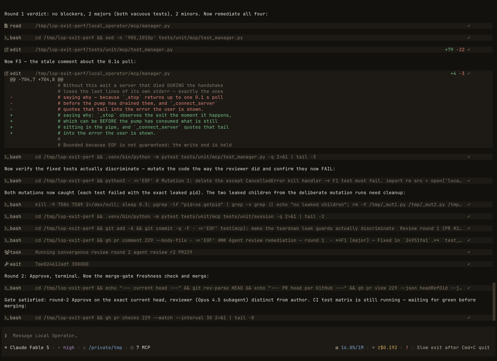
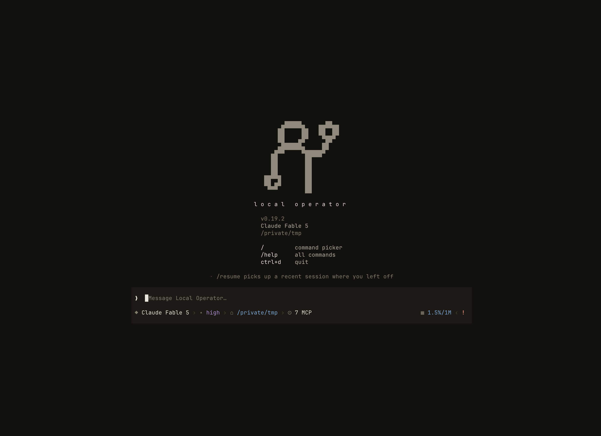
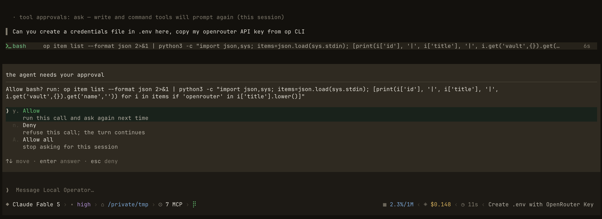
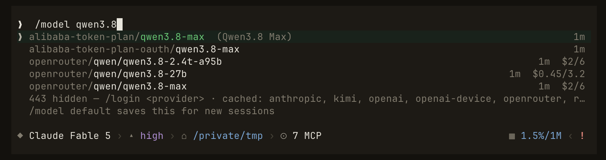
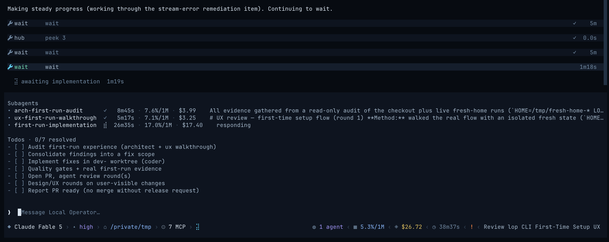
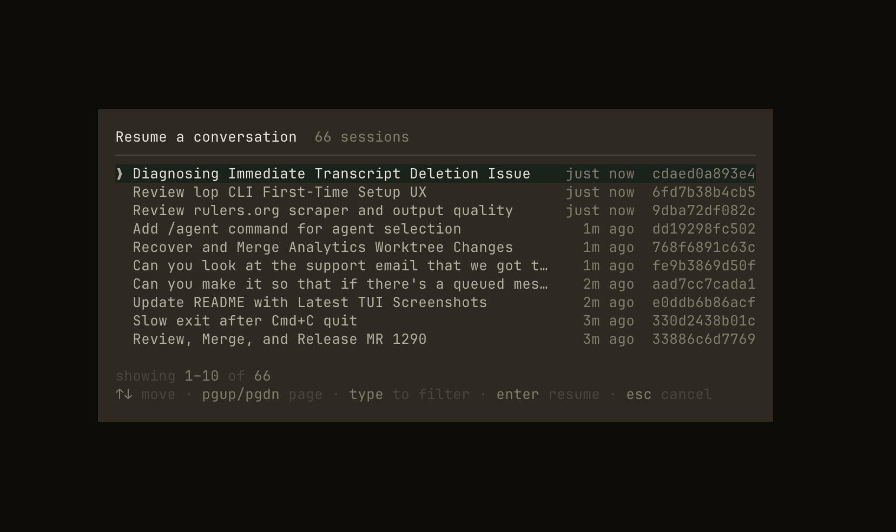
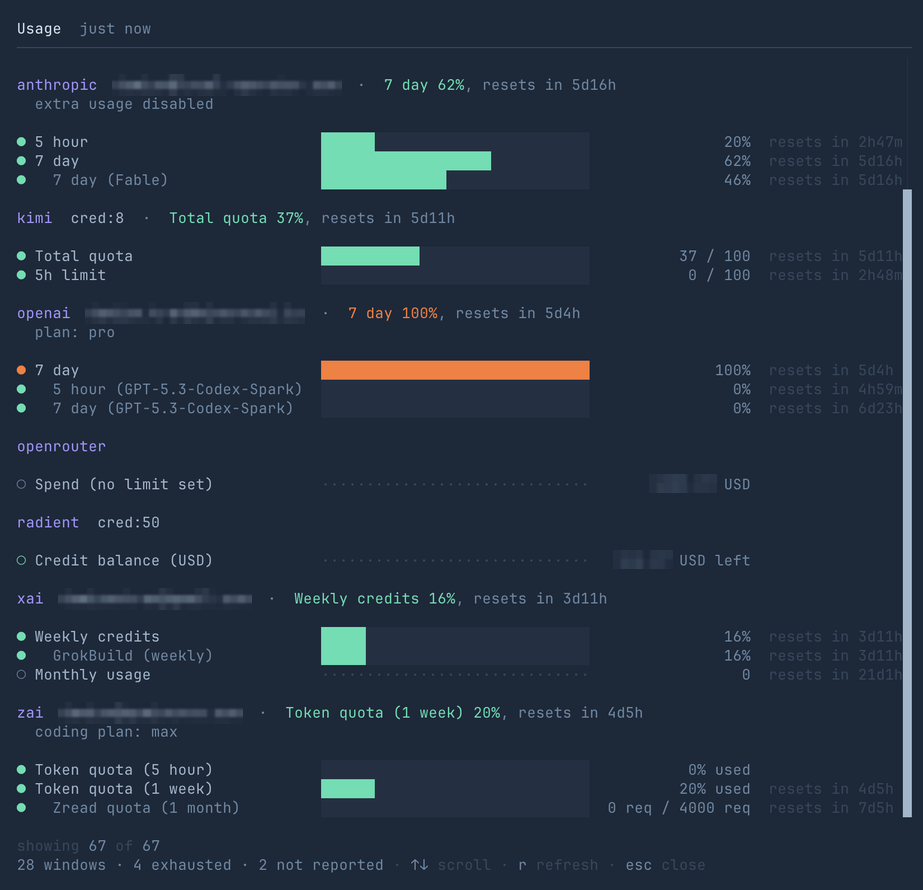
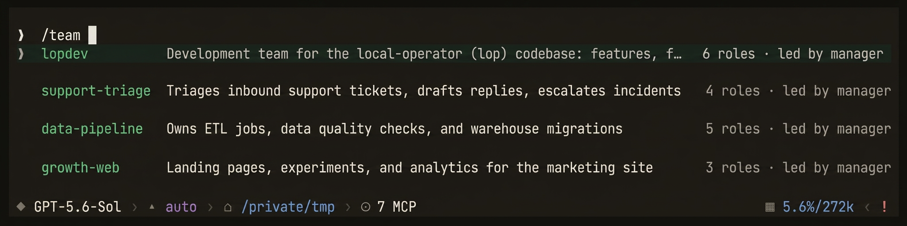
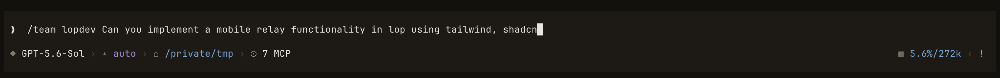
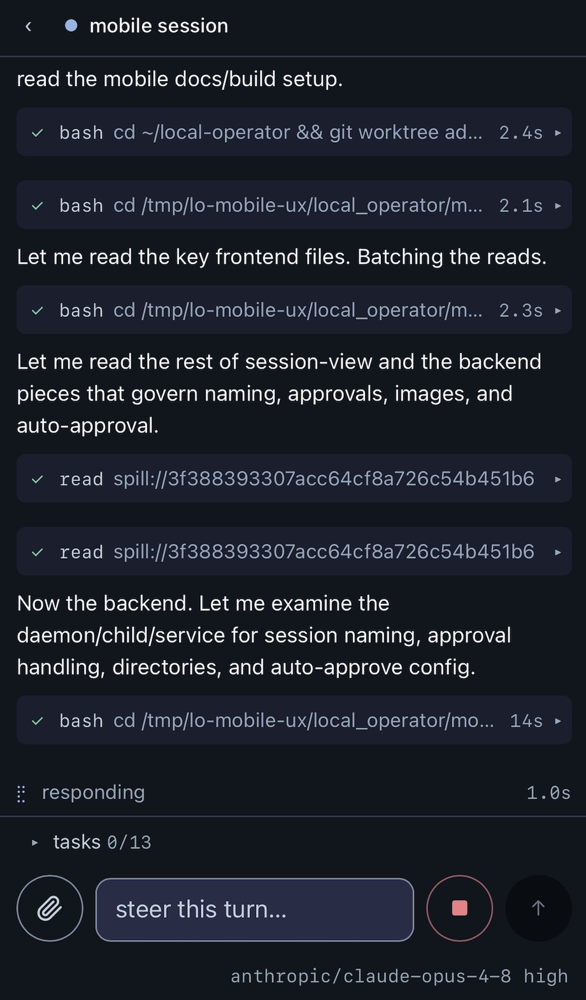

<picture>
  <source media="(prefers-color-scheme: dark)" srcset="./static/local-operator-icon-2-dark-clear.png">
  <source media="(prefers-color-scheme: light)" srcset="./static/local-operator-icon-2-light-clear.png">
  
</picture>

<h1 align="center">Local Operator</h1>
<div align="center">
  <h3>An open-source AI agent that lives in your terminal and works on your machine</h3>
  <p><i>Plans, runs tools, browses, spawns subagents, and remembers — all from a fast terminal UI</i></p>
</div>

<br />

<p align="center">
  
</p>

<p align="center"><i>The Local Operator TUI mid-task: streamed responses, expandable tool cards, and one-line receipts for everything the agent does.</i></p>

<br />

**Local Operator** is a terminal-native AI agent: describe what you want done
and it does the work on your machine, asking before anything writes or
executes. It is MIT-licensed and built to be lived in — sessions persist and
resume, context compacts itself before it overflows, and the agent can
schedule its own follow-ups.

<div align="center">
  <a href="#-quickstart">Quickstart</a> •
  <a href="#️-a-tour-of-the-tui">Tour</a> •
  <a href="#-providers">Providers</a> •
  <a href="#️-headless--server-modes">Headless & Server</a> •
  <a href="#-contributing">Contribute</a>
</div>

## 📚 Table of Contents

- [✨ Why Local Operator](#-why-local-operator)
- [🚀 Quickstart](#-quickstart)
- [🖥️ A Tour of the TUI](#️-a-tour-of-the-tui)
  - [Slash commands](#slash-commands)
  - [Keys worth knowing](#keys-worth-knowing)
- [🔌 Providers](#-providers)
- [🧰 What the Agent Can Do](#-what-the-agent-can-do)
  - [🔎 Web search](#-web-search)
  - [🤝 Subagents, agent profiles, and teams](#-subagents-agent-profiles-and-teams)
  - [🧠 Skills and guides](#-skills-and-guides)
  - [🔗 MCP servers](#-mcp-servers)
- [⚙️ Headless & Server Modes](#️-headless--server-modes)
- [📱 Phone Access (Mobile Relay)](#-phone-access-mobile-relay)
- [📦 Installation Options](#-installation-options)
- [🔧 Configuration & Credentials](#-configuration--credentials)
- [🌟 Radient Agent Hub](#-radient-agent-hub)
- [🔒 Safety Model](#-safety-model)
- [📝 Examples](#-examples)
- [👥 Contributing](#-contributing)
- [🙏 Credits and Acknowledgements](#-credits-and-acknowledgements)
- [📜 License](#-license)

## ✨ Why Local Operator

- **A real terminal UI, not a REPL.** A full-screen [Textual](https://textual.textualize.io/)
  app with streamed responses, expandable tool cards, session resume, 20+
  built-in themes with live preview, and a status line that tells you what
  the agent is doing and what it costs.
- **Sign in with the account you already have.** OAuth login for OpenAI
  (ChatGPT), Anthropic (Claude), Kimi, xAI, Z.AI, and Qwen — or bring an API
  key, or run entirely offline with Ollama.
- **Approval-gated execution.** Reads are automatic; writes and shell commands
  ask first. `/approvals auto` (or `--yolo`) opts out deliberately, per
  session or as a saved default.
- **An agent workforce, not just an agent.** Fan work out to concurrent
  subagents with tool-restricted roles (a `reviewer` that cannot edit what it
  reviews), author reusable agent profiles, and save whole teams — a manager
  plus a roster — you launch by name with `/team`. Peek at, steer, pause, or
  cancel any worker mid-flight.
- **A session you can leave and come back to.** Transcripts persist,
  `/resume` picks up where you left off, and context compaction runs itself
  before the window fills, so long sessions don't fall off a cliff.
- **Skills, MCP, scheduled wakes, web search, a browser tool** — the agent's
  toolbox is broad, and everything it does leaves a visible receipt in the
  transcript.

## 🚀 Quickstart

Requires Python 3.12+.

```bash
pip install local-operator     # pipx install local-operator on Linux (PEP 668)
```

The install provides both `local-operator` and its short alias `lop` — the
rest of this page uses `lop`.

Sign in to a provider (or skip this — the app tells you what's missing on
first run):

```bash
lop login           # lists login-capable providers
lop login anthropic # OAuth sign-in in your browser
```

Then start it:

```bash
lop
```

That's it. Type what you want done. `esc` stops the agent, `/help` lists
commands, `/exit` quits.

<p align="center">
  
</p>

Prefer a fully local model? Install [Ollama](https://ollama.com/download),
pull a model, and point the agent at it:

```bash
lop --hosting ollama --model qwen2.5:14b
```

## 🖥️ A Tour of the TUI

Everything the agent does shows up as a card or a one-line receipt. Tool
cards expand (`enter`/`space`) to show the full command and output; the
status line tracks the current step, token usage, and cost.

When a tool call needs your sign-off, the approval prompt shows exactly what
is about to run before anything touches your system:

<p align="center">
  
</p>

Switching models is a picker, not a config file — `/model` lists every model
your signed-in providers offer, with fuzzy filtering:

<p align="center">
  
</p>

Ask for parallel work and the agent delegates: the subagent dock shows each
worker's status, spend, and progress live, and you can open any of them to
watch its transcript. (This shot also shows one of the 20+ built-in themes —
`/theme` previews them live as you arrow through the list.)

<p align="center">
  
</p>

Coming back later is `/resume` — a picker over your recent sessions, each
with its title and age:

<p align="center">
  
</p>

And `/usage` answers the question every agent user has: how much provider
quota is left, and what the account has spent (the status line tracks the
current session's cost live).

<p align="center">
  
</p>

### Slash commands

`/help` shows the full table in-app. The highlights:

| Command | What it does |
| --- | --- |
| `/model` | Switch model for this session; `/model default` saves it for new ones |
| `/effort` | Show or set reasoning effort (`shift+tab` cycles) |
| `/approvals` | Set whether tools ask first (`ask`/`auto`; add `default` to keep it) |
| `/resume` | Pick a past conversation and continue it |
| `/new`, `/clear`, `/reload` | Fresh conversation · wipe the screen · reboot the session in place |
| `/goal`, `/loop` | Set an objective, then iterate autonomously toward it |
| `/btw` | Ask a side question off the record — it never joins the conversation |
| `/compact` | Compact the context now (it also happens automatically) |
| `/usage`, `/context` | Provider quota and account spend · what's occupying the context window |
| `/provider`, `/login`, `/logout`, `/accounts`, `/credential` | Manage providers and stored credentials |
| `/search` | Configure web-search providers and load balancing |
| `/team` | Launch a saved team: `/team <name> <request>` puts a manager and roster on it |
| `/skills`, `/mcp` | List loaded skills · MCP servers |
| `/theme`, `/rename` | Pick from 20+ built-in themes (arrows preview live) · rename the session |

### Keys worth knowing

- **Type while the agent works** — your message is delivered at the next
  step as steering, no need to wait.
- `esc` — stop the agent without ending the session.
- `ctrl+b` — open an aside (side question) without losing what you were typing;
  `ctrl+f` promotes the aside into the conversation.
- `shift+tab` — cycle reasoning effort.
- `ctrl+l` — clear the transcript (history is untouched).

## 🔌 Providers

One agent, your choice of brain. OAuth providers sign in through the browser
and use your existing subscription; API-key providers prompt once and store
the key locally; Ollama runs models on your own hardware.

| Provider | Access |
| --- | --- |
| OpenAI / ChatGPT | OAuth (browser or device code) or `OPENAI_API_KEY` |
| Anthropic / Claude | OAuth or `ANTHROPIC_API_KEY` |
| Kimi (Moonshot) | OAuth or `KIMI_API_KEY` |
| xAI / Grok | OAuth or `XAI_API_KEY` |
| Z.AI (GLM) | OAuth or `ZAI_API_KEY` |
| Qwen (Alibaba) | OAuth (token plan) or API key |
| Google Gemini | `GOOGLE_AI_STUDIO_API_KEY` |
| DeepSeek | `DEEPSEEK_API_KEY` |
| Mistral | `MISTRAL_API_KEY` |
| OpenRouter | `OPENROUTER_API_KEY` — one key, many models |
| Radient | `RADIENT_API_KEY` — automatic per-step model selection |
| Ollama | Local, no key, no network |

```bash
lop login              # list login-capable providers
lop login openai       # OAuth flow
lop login-status       # what's signed in
lop logout kimi
```

Legacy `--hosting <name> --model <name>` flags keep working, and API keys can
be stored with `lop credential update <KEY_NAME>` (a masked prompt).

## 🧰 What the Agent Can Do

The agent's built-in tools, each with its own card in the transcript:

- **Run things** — `bash` (shell commands), `eval` (a persistent Python
  kernel: variables survive across calls).
- **Work with files** — `read`, `write`, `edit` (surgical search/replace),
  `glob`, `grep`, plus `lsp` for Jedi-backed Python code intelligence.
- **Reach the web** — load-balanced `web_search` across seven providers and a
  `browser` tool for pages that need rendering or interaction.
- **Stay organized** — a visible `todo` list for multi-step work, `ask` to
  put real decisions back to you as a picker instead of a wall of text.
- **Work in the background** — `task` spawns subagents, `jobs`/`wait`/`hub`
  manage and talk to them, and `wake` schedules future follow-ups
  ("check the build again in 30 minutes").

### 🔎 Web search

Search works out of the box — DuckDuckGo and Tavily's keyless endpoint are
enabled by default, and requests rotate across providers with automatic
fallback when one is rate-limited or down:

```bash
lop search list
lop search test "Python 3.13 release notes"
lop search enable perplexity
lop search setup brave --api-key
lop search setup tavily --oauth      # official Tavily MCP server
lop search setup searxng --endpoint https://search.example.com
```

| Provider | Access | Default |
| --- | --- | --- |
| DuckDuckGo | Credential-free | Enabled |
| Tavily | Keyless, `TAVILY_API_KEY`, or OAuth MCP | Enabled |
| Perplexity | Anonymous or `PERPLEXITY_API_KEY` | Disabled |
| Brave | `BRAVE_API_KEY` | Disabled |
| Exa | `EXA_API_KEY` | Disabled |
| SerpApi | `SERPAPI_API_KEY` | Disabled |
| SearXNG | Self-hosted endpoint URL | Disabled |

The same controls are available in-app via `/search`.

### 🤝 Subagents, agent profiles, and teams

This is where Local Operator stops being a chatbot and starts being a staff.

**Subagents.** Ask for parallel work and the agent fans it out into concurrent
background workers, then keeps working while they run. Each worker is
addressable: peek at its transcript, send it a note, ask it a question, steer
it onto a different course, pause it, or resume it later — all without
burning its attention on status meetings.

**Roles are capability boundaries, not just prompts.** A subagent launched as
`reviewer` carries vetted review guidance *and loses the tools to edit code*
— it can read and run tests but cannot alter what it reviews, which is what
keeps a review honest. Packaged starters ship for `reviewer`, `coder`,
`architect`, `manager`, `designer`, and `scout`, and you can author your own
**agent profiles**: reusable roles and named specialists with their own
instruction sets, matched to tasks by semantic routing. When a profile gives
bad guidance, you fix the profile once — not every prompt that uses it.

**Teams.** A saved roster — a manager plus members with counts — layered with
two briefs the individual agents never hard-code: a *collaboration* brief (how
this group works together, who blocks a release) and a *project* brief (what
product this instance owns). Swap the project brief and the same roster staffs
a different product. `/team` lists your saved teams:

<p align="center">
  
</p>

<p align="center"><i>The team picker. Launch one with <code>/team &lt;name&gt; &lt;request&gt;</code> — the current agent becomes that roster's manager and delegates from there:</i></p>

<p align="center">
  
</p>

Sending a request to a team is one line — the manager breaks it down and puts
the right roles on it.

Agents can also be managed from the CLI:

```bash
lop agents create "My Agent"
lop agents list
lop teams list
```

### 🧠 Skills and guides

Drop a `SKILL.md` (with optional reference files) into
`~/.local-operator/skills/<name>/` and the agent indexes it semantically —
only the skills relevant to the current turn are surfaced, and their bodies
load on demand via `skill://<name>` reads, so your context isn't taxed by
knowledge you aren't using. `/skills` lists what's loaded.

### 🔗 MCP servers

Local Operator speaks [MCP](https://modelcontextprotocol.io/) over the
official SDK, with lazy tool loading: servers advertise a bounded summary,
and individual tool schemas enter the context only when the agent actually
enables them.

```bash
lop mcp add linear --url https://mcp.linear.app/mcp --oauth
lop mcp login linear     # complete the OAuth flow
lop mcp list
```

Server configs are discovered from the project (`.local-operator/mcp.json`,
`.mcp.json`), your home directory, and best-effort imports of Claude Code,
Cursor, and VS Code configs — so servers you already configured
elsewhere just show up. See [docs/mcp.md](./docs/mcp.md) for the trust model
before enabling project-supplied servers.


## ⚙️ Headless & Server Modes

**One-shot execution** for scripts and automation:

```bash
lop exec "summarize the failures in ./test.log"
lop exec "long migration" --background   # detach with a log file
lop exec "audit deps" --json             # one JSON line per event
```

Exit code 0 on success — pipeline-friendly.

**Server mode** exposes the agent as a FastAPI service (used by the optional
[desktop UI](https://github.com/damianvtran/local-operator-ui)):

```bash
pip install "local-operator[server]"
lop serve                 # http://localhost:1111, docs at /docs
```

**Phone access** — an optional session daemon lets you watch and steer
your sessions from your phone. See
[Phone Access (Mobile Relay)](#-phone-access-mobile-relay) below.

## 📱 Phone Access (Mobile Relay)

`lop mobile` turns the machine you run agents on into a phone-facing control
plane for every `lop` session on it. A single supervised **session daemon**
owns the web surface, and every interactive TUI session registers with it
automatically over an authenticated loopback socket. From your phone you can
watch transcripts stream, steer a running turn, switch model and effort, run
slash commands, drill into subagents, and start brand-new sessions. Sessions
you start from the phone also answer their own approval and ask prompts there;
for a terminal session those prompts are still answered at the terminal (the
phone shows that it is waiting).

<p align="center">
  
</p>

<p align="center"><i>A live <code>lop</code> session driven from a phone: the same transcript, tool cards, and composer as the TUI, mobilized.</i></p>

**You can ask Local Operator to set this up for you.** Tell your agent
something like *"set up phone access"* and it will walk through the install,
confirm the health check and the closed auth gate, and get you the portal
password through a channel you choose (or leave it in the Keychain for you to
retrieve). If you would rather do it by hand:

```bash
lop mobile install      # generate/keep the portal password, install the daemon, verify health
lop mobile status       # install state, health probe, and registered sessions
lop mobile password     # show or rotate the portal password
lop mobile logs -f      # follow the daemon log
```

Once the daemon is up, every interactive `lop` you start publishes itself and
shows up in the phone list live. No extra flag per session.

### Additional setup is required for remote access

The daemon binds **loopback only** (`127.0.0.1:4098`) and never a wider
address. That keeps it private by construction, so reaching it from your
phone over the internet needs a secure path you put in front of it, together
with an identity proxy so only you can open it.

The **recommended method is a [Cloudflare Tunnel](https://developers.cloudflare.com/cloudflare-one/connections/connect-networks/)**
with Cloudflare Access in front: the tunnel gives the daemon a public
hostname without opening a port on your machine, and Access enforces
sign-in before any request reaches loopback. A WireGuard-based mesh such as
[Tailscale](https://tailscale.com/) is a good alternative if you would rather
keep everything on a private network. Either way, do not change the bind
address to expose the daemon directly; put the tunnel and the identity proxy
in front of the loopback listener instead.

The portal itself is protected by a single password (Keychain-backed on
macOS, or `LOP_MOBILE_PASSWORD` for containers), and session cookies are
derived from it, so rotating the password invalidates every logged-in phone.

## 📦 Installation Options

The default install is deliberately small. Optional features live behind
extras:

| Extra | Adds |
| --- | --- |
| `server` | The HTTP API server (`lop serve`) and background scheduler |
| `mcp` | Model Context Protocol client support |
| `images` | HEIC/HEIF image attachment decoding |
| `tokenizer` | Exact BPE token counting (estimated otherwise) |
| `lsp` | Jedi-backed symbol-aware Python navigation for the `lsp` tool |
| `all` | Everything above except `lsp` |

```bash
pip install "local-operator[all]"    # quote it — shells glob the brackets
```

If you hit a feature whose extra is missing, the agent tells you which one to
install instead of failing with an import error.

**Nix**: `nix develop` drops you into a reproducible dev shell via the
provided `flake.nix`.

**Docker**: `docker compose up -d` with the provided compose file.

## 🔧 Configuration & Credentials

Configuration lives at `~/.local-operator/config.yml`:

```bash
lop config create      # scaffold it
lop config list        # every option, with descriptions
lop config edit <key> <value>
lop config open        # open it in your editor
```

Commonly set values: `hosting` and `model_name` (skip the CLI flags),
`conversation_length` / `detail_length` (history kept verbatim vs
summarized), and `tui.theme` (any registered theme name — easier to set with
`/theme`, which previews live).

Credentials are stored in `~/.local-operator/credentials.env` and never
echoed:

```bash
lop credential update TAVILY_API_KEY
lop credential delete TAVILY_API_KEY
```

OAuth tokens from `lop login` are stored separately and refresh
themselves.

## 🌟 Radient Agent Hub

[Radient](https://console.radienthq.com) adds two optional capabilities:

- **Automatic model selection** — `lop --hosting radient` picks
  the best model per step to balance quality and cost, no `--model` needed.
- **Agent sharing** — push your agents to the public hub, pull agents others
  published:

```bash
lop credential update RADIENT_API_KEY
lop agents push --name "My Agent"
lop agents pull --id "<agent_id>"     # no key needed to pull
```

## 🔒 Safety Model

- **Approval tiers.** Read-only tools run automatically; anything that writes
  files or executes commands prompts first, showing the exact command.
  `/approvals auto` or `--yolo` disables prompts only when you say so.
- **Visible receipts.** Every tool call leaves a card or one-line receipt in
  the transcript — there is no invisible action.
- **Local-first options.** Run Ollama models for closed-circuit operation
  where nothing leaves your machine.
- **MCP trust model.** Project-supplied MCP configs are treated as trusted
  input and warned about on first connect — see [docs/mcp.md](./docs/mcp.md).
- **Credential hygiene.** Keys live in a local credential store, are entered
  through hidden prompts, and are kept out of transcripts.

## 📝 Examples

👉 The [example notebooks](./examples/notebooks/) show real tasks completed
with Local Operator, saved from live sessions:

- 🔄 **[Automated commit message generation](examples/notebooks/github_commit.ipynb)** from git diffs
- 🔀 **[End-to-end pull request automation](examples/notebooks/github_pr.ipynb)** — creation, review, template completion
- 🔢 **[MNIST digit recognition](examples/notebooks/kaggle_digit_recognizer.ipynb)** — 99.3% accuracy on the Kaggle competition
- 🏠 **[House price prediction with XGBoost](examples/notebooks/kaggle_home_data_competition.ipynb)** — top 5% Kaggle score
- 🚢 **[Titanic survival prediction](examples/notebooks/kaggle_titanic_competition.ipynb)** with LightGBM
- 🌐 **[Web research and data extraction](examples/notebooks/web_research_scraping.ipynb)** — scraping a sanctions list
- 📈 **[Business pricing analysis](examples/notebooks/business_pricing_margin.ipynb)** — optimal subscription pricing

## 👥 Contributing

We welcome contributions! See [CONTRIBUTING.md](CONTRIBUTING.md) for how to
submit bug reports and feature requests, set up a development environment,
and open pull requests. `docs/` covers the architecture
([REWRITE.md](./docs/REWRITE.md)), benchmarks, and verification evidence.

## 🙏 Credits and Acknowledgements

Local Operator stands on the shoulders of the broader open-source agent
community. Several aspects of this harness's implementation were shaped by
studying and drawing inspiration from the projects below. We're grateful to
their authors and contributors for building in the open.

- **[opencode](https://github.com/anomalyco/opencode)** — created by
  [Dax Raad (`thdxr`)](https://github.com/thdxr) and the Anomaly (formerly SST)
  team. Its terminal-native, model-agnostic coding-agent design informed our
  thinking on the interactive CLI experience and provider-agnostic model
  handling.
- **[oh-my-pi](https://github.com/can1357/oh-my-pi)** — authored and maintained
  by [Can Bölük (`can1357`)](https://github.com/can1357), building on
  [Pi](https://github.com/badlogic/pi-mono) by
  [Mario Zechner (`mariozechner`)](https://github.com/mariozechner). Its
  approach to agent orchestration and harness ergonomics inspired aspects of our
  subagent and tooling implementation.

Inspiration drawn from these projects informed our own independent
implementation; any mistakes here are our own.

### A note on reuse and credit

All of the projects above are MIT-licensed, as is Local Operator itself. Under
the MIT license you are free to draw inspiration from or reuse code from Local
Operator in your own work. We ask only that credit be given where credit is due
— an acknowledgement of the projects and people whose work you build on, in the
same spirit as the credits above. It costs little and it keeps open source
healthy.

Core contributor: Damian Tran &lt;[damian@gominerva.com](mailto:damian@gominerva.com)&gt;.

## 📜 License

MIT — see [LICENSE](LICENSE) for details.
