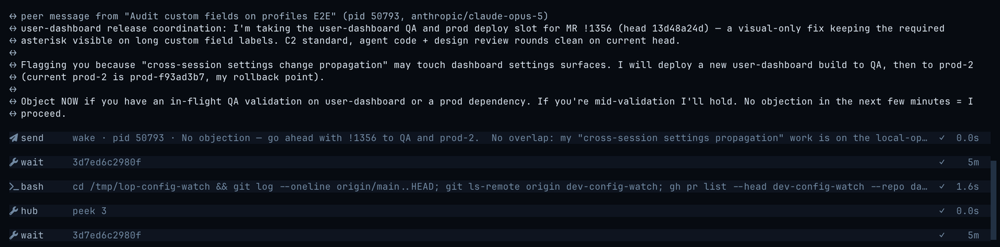

<picture>
  <source media="(prefers-color-scheme: dark)" srcset="./static/local-operator-icon-2-dark-clear.png">
  <source media="(prefers-color-scheme: light)" srcset="./static/local-operator-icon-2-light-clear.png">
  
</picture>

<h1 align="center">Local Operator</h1>
<div align="center">
  <h3>An open-source AI agent hub: build organizations of collaborating agents that run on your own machine, around the clock</h3>
  <p><i>Roles, teams, and cross-agent messaging on top of a fast terminal UI — using every AI subscription you already pay for</i></p>
</div>

<br />

<p align="center">
  
</p>

<p align="center"><i>The Local Operator TUI mid-task: streamed responses, expandable tool cards, and one-line receipts for everything the agent does.</i></p>

<br />

**Local Operator** is a harness for running not one agent but an
organization of them. A single session plans, runs tools, browses, and
remembers; give it a team and it becomes a manager delegating to
tool-restricted workers, messaging sibling sessions in other repos, scheduling
its own follow-ups, and picking those follow-ups back up after you close the
terminal. Everything runs on your machine, asks before it writes or executes,
and draws on every ChatGPT, Claude, Kimi, xAI, Z.AI, and Qwen login you
already have — pooled, load-balanced, and used with the prompt cache in mind.
MIT-licensed.

<div align="center">
  <a href="#-quickstart">Quickstart</a> •
  <a href="#-agent-organizations">Organizations</a> •
  <a href="#-use-every-subscription-you-already-pay-for">Subscriptions</a> •
  <a href="#-always-on">Always On</a> •
  <a href="#-providers">Providers</a> •
  <a href="#-contributing">Contribute</a>
</div>

## 📚 Table of Contents

- [✨ Why Local Operator](#-why-local-operator)
- [🚀 Quickstart](#-quickstart)
- [🏢 Agent Organizations](#-agent-organizations)
- [↔ Cross-Agent Communication](#-cross-agent-communication)
- [🌙 Always On](#-always-on)
- [💳 Use Every Subscription You Already Pay For](#-use-every-subscription-you-already-pay-for)
- [🧮 Built for Token and Cache Efficiency](#-built-for-token-and-cache-efficiency)
- [🖥️ A Tour of the TUI](#️-a-tour-of-the-tui)
  - [Slash commands](#slash-commands)
  - [Keys worth knowing](#keys-worth-knowing)
- [🔌 Providers](#-providers)
- [🧰 What the Agent Can Do](#-what-the-agent-can-do)
  - [🔎 Web search](#-web-search)
  - [🧠 Skills and guides](#-skills-and-guides)
  - [🔗 MCP servers](#-mcp-servers)
- [⚙️ Headless & Server Modes](#️-headless--server-modes)
- [📱 Phone Access (Mobile Relay)](#-phone-access-mobile-relay)
- [🌐 Drive Your Own Browser (Browser Extension)](#-drive-your-own-browser-browser-extension)
- [📦 Installation Options](#-installation-options)
- [🔧 Configuration & Credentials](#-configuration--credentials)
- [🌟 Radient Agent Hub](#-radient-agent-hub)
- [🔒 Safety Model](#-safety-model)
- [📝 Examples](#-examples)
- [👥 Contributing](#-contributing)
- [🙏 Credits and Acknowledgements](#-credits-and-acknowledgements)
- [📜 License](#-license)

## ✨ Why Local Operator

- **Agent organizations, not a lone agent.** Roles are capability boundaries
  (a `reviewer` loses the tools to edit what it reviews), specialists carry
  their own standing instructions, and a team is a manager plus a roster plus
  two briefs — how the group collaborates and what product it owns. Rosters
  can declare nested teams, and `/team chart` draws the org chart.
- **Agents that talk to each other.** A manager peeks at, questions, steers,
  pauses, and resumes its subagents through `hub`; independent sessions in
  different repos message each other with `send`, choosing whether to leave a
  note, wake an idle peer, or redirect one mid-turn. Loopback only, your OS
  account only.
- **Always on.** Wakes persist and fire on schedule even after the terminal is
  closed; long commands and subagents run as background jobs whose results
  auto-deliver when the session is idle; `lop exec --background` detaches a
  whole task; a paused subagent resumes after a process restart; the mobile
  daemon keeps every session reachable from your phone.
- **Every subscription you already pay for.** OAuth into ChatGPT, Claude,
  Kimi, xAI, Z.AI, and Qwen. Several accounts on one provider form a
  rotation pool; the least-loaded account is picked first, a quota failure
  rotates to a sibling, and only when the pool is spent does the cascade walk
  your model fallback chain.
- **Built for token and cache efficiency.** A stable tool array and
  `cache_control` on stable system blocks keep the prompt-cache prefix warm;
  superseded tool output is pruned without disturbing the warm suffix; the
  Anthropic 1-hour cache TTL switches on automatically for large contexts;
  skills and MCP schemas load only on demand; and `wait` returns on job
  settle or message arrival so agents never poll and re-buy their context.
- **Approval-gated by default.** Reads run; writes and shell commands show the
  exact command and ask. `/approvals auto` or `--yolo` opts out deliberately.
  Every tool call leaves a visible receipt in the transcript.
- **Reach beyond the terminal.** Watch and steer sessions from your phone,
  and drive the Chromium browser you already use — with your real logins —
  through the published browser extension.

## 🚀 Quickstart

Bring Python 3.12+ and one of: a provider login (ChatGPT, Claude, Kimi, xAI,
Z.AI, or Qwen), an API key, or a local model server.

```bash
pip install local-operator     # pipx install local-operator on Linux (PEP 668)
lop login anthropic            # OAuth sign-in in your browser; `lop login` lists providers
lop                            # start it, then type what you want done
```

`lop` is the short alias the install provides alongside `local-operator`; the
rest of this page uses it. `lop login <provider>` also sets that provider as
your default hosting and picks a default model when none is configured, so the
very next `lop` just works. Skip the login and an interactive `lop` opens in a
setup state and walks you through `/login`; a headless or piped run prints the
exact commands to configure hosting, model, and a key instead.

Inside, `esc` stops the agent, `/help` lists commands, `/exit` quits. `lop
update` upgrades the install from PyPI.

<p align="center">
  
</p>

Prefer a local model? Start [LM Studio](https://lmstudio.ai), load a chat model,
and enable its server in the Developer tab; then `/login lmstudio` inside
Local Operator picks the endpoint and model. `/login` also offers Ollama, vLLM,
llama.cpp, and a generic OpenAI-compatible server — see the
[local-provider guide](docs/LOCAL_PROVIDERS.md). The CLI form still works for a
model installed in [Ollama](https://ollama.com/download):

```bash
lop --hosting ollama --model qwen2.5:14b
```

## 🏢 Agent Organizations

This is where Local Operator stops being a chatbot and starts being a staff.

**Subagents.** Ask for parallel work and the agent fans it out into concurrent
background workers, then keeps working while they run. The subagent dock shows
each worker's status, spend, and progress live, and you can open any of them to
read its transcript and plan (the reader's keys and limits are in
[docs/subagent-reader.md](./docs/subagent-reader.md)).

<p align="center">
  
</p>

**Roles are capability boundaries, not just prompts.** A subagent launched as
`reviewer` carries vetted review guidance *and loses the tools to edit code*
— it can read and run tests but cannot alter what it reviews, which is what
keeps a review honest. A restricted role cannot enable new MCP tools either,
and the restriction is inherited by everything it delegates to, at any depth.
Packaged starters ship for `reviewer`, `coder`, `architect`, `manager`,
`designer`, and `scout`, and you can author your own **agent profiles**:
reusable roles and named specialists with their own instruction sets, matched
to tasks by semantic routing. When a profile gives bad guidance, you fix the
profile once — not every prompt that uses it.

**Teams.** A saved roster — a manager plus members with counts — layered with
two briefs the individual agents never hard-code: a *collaboration* brief (how
this group works together, who blocks a release) and a *project* brief (what
product this instance owns). Swap the project brief and the same roster staffs
a different product. A roster slot can name another team (`team:<name>`), so a
team becomes an org of teams; `/team chart <name>` draws it as an org chart.
The runtime that lets a manager delegate *into* a nested team's manager is a
follow-up, and the chart tags those nodes `(declared)` so it never implies a
wiring that is not live yet.

<p align="center">
  
</p>

<p align="center"><i>The team picker. Launch one with <code>/team &lt;name&gt; &lt;request&gt;</code> — the current agent becomes that roster's manager and delegates from there:</i></p>

<p align="center">
  
</p>

Sending a request to a team is one line — the manager breaks it down and puts
the right roles on it. Agents and teams can also be managed from the CLI:

```bash
lop agents create "My Agent"
lop agents list
lop teams list
lop teams show lopdev
```

## ↔ Cross-Agent Communication

Two shapes of conversation, one machine, no cloud in the middle.

**Down the tree.** Every worker a session spawns is addressable through `hub`:
`peek` reads the last few steps of its transcript without spending its
attention, `ask` poses a question and waits for the answer, `send` drops a
note, `steer` changes its course, `pause` stops it while keeping it resumable,
`cancel` ends it, and `resume` relaunches a stopped, paused, or settled child
against its own transcript — including after the parent process has restarted.

**Across sessions.** Two `lop` sessions you started yourself, in different
repos, with no parent between them and no shared context, can message each
other directly. One can tell another to hold off on a deploy, hand over a
finished branch, or claim a shared resource, without you relaying it between
terminals.

<p align="center">
  
</p>

<p align="center"><i>Two independent sessions negotiating a shared deploy slot. One claims it and asks for objections; the other checks its own in-flight work and clears it. No human in the loop.</i></p>

`lop sessions` is the directory of every session on the machine — state,
pid, kind, conversation, model, memory footprint, uptime, and heartbeat age
(`--json` adds `cwd` and `session_id`). From a shell you use `lop send`; from
inside a session the agent uses its own `send` tool, which lands as an
auditable card in its transcript. Both share three delivery modes: the default
mailbox writes the message to the target's history and lets an idle session
stay idle; `--wake` also starts a turn if the target is idle; `--now` injects
mid-turn to redirect a session that is actively working. A running `bash`,
`eval`, or MCP call is never cut short, and a session parked in `wait` returns
early to read the message.

```bash
lop sessions
lop send "release cutter" "gates are green, ready for review"
lop send "release cutter" --wake "the deploy finished; verify prod"
lop send "ingest refactor" --now "hold off, the schema changed"
lop send --pid 12345 "gates are green, ready for review"   # address by exact pid
git log -1 --stat | lop send "release cutter"      # body from stdin
```

Every delivery leaves a receipt on both ends: the target sees an inbound
`↔ peer message from "<conversation>" (pid N, <model>)` card, and the sender
gets back how the message landed. Targeting is a case-insensitive substring
over conversation name, session id, and cwd basename, and it refuses to guess:
an ambiguous match lists the candidates and exits non-zero rather than
delivering to the wrong session. The trust boundary is your OS account — every
session publishes a `0600` discovery record under a `0700` directory and
answers on an authenticated loopback server, so there is no remote or
cross-user path. The full targeting and refusal rules, the receipt strings,
and the limits (256 KB bodies; headless `exec` sessions may not receive) are
in the packaged [peer-messaging guide](./local_operator/guides/peer-messaging/GUIDE.md).

## 🌙 Always On

An agent that only works while you watch it is a chatbot. Local Operator is
built so work keeps moving after you walk away.

- **Scheduled wakes that survive a closed terminal.** The agent's `wake` tool
  schedules a future turn ("check the build again in 30 minutes"). Schedules
  persist with the session, and on macOS a small **wake supervisor**
  (installed on demand as a LaunchAgent the first time a wake is scheduled)
  starts a runtime for whichever session's wake is due — so a wake fires even
  if you closed the terminal that scheduled it. A session that was asleep past
  a due time fires the wake late and reports how many occurrences it skipped,
  rather than replaying six hourly checks at once. `lop wake status` and `lop
  wake list` show what is installed and what fires next.
- **Background jobs that report back on their own.** `bash` and `task` run in
  the background; a long command interrupted by a steer detaches instead of
  dying; and every settled job auto-delivers its result when the session is
  idle. `jobs` peeks at new output since your last look.
- **`lop exec --background`** detaches a whole task with a log file and exits
  immediately.
- **Waiting without polling.** `wait` blocks up to 60 minutes and returns the
  moment a job settles, a message arrives (a peer's `send`, a wake, a
  subagent's `hub` note), or you steer — one sized wait instead of a chain of
  short polls that each re-send the whole context.
- **Resume after a restart.** Transcripts persist and `/resume` picks a
  session back up; a paused or settled subagent can be resumed with `hub
  op='resume'` after the parent process has restarted; inside a multiplexer,
  `lop` publishes a per-pane crash-restore binding
  ([multiplexer-resume.md](./docs/multiplexer-resume.md)) and reports its live
  state to a [Herdr](https://herdr.dev) Agents panel
  ([herdr-agents.md](./docs/herdr-agents.md)).
- **A daemon that keeps sessions reachable.** `lop mobile install` runs a
  supervised session daemon; every interactive session registers with it, and
  you watch, steer, and start sessions from your phone — see
  [Phone Access](#-phone-access-mobile-relay).

## 💳 Use Every Subscription You Already Pay For

Sign in to ChatGPT, Claude, Kimi, xAI, Z.AI, and Qwen with the accounts you
already have — `lop login <provider>` opens the OAuth flow, and running it
again for the same provider adds another account rather than replacing the
first. API keys and local servers sit alongside. Then:

- **Accounts on one provider form a rotation pool.** A session's first pick
  is usage-aware: the accounts with the most remaining quota form a bucket,
  and a per-session hash rotates within it so concurrent sessions fan out
  instead of herding onto one row. This exists because a plain hash left three
  of five accounts at 65–99% of their window while two sat near idle.
- **Failover is a cascade, not a coin flip.** On a quota or auth failure the
  request rotates to a sibling account first (Tier 1). Only when the pool is
  spent does it walk your **model fallback chain** (Tier 2, `retry.fallbackChains`
  in `config.yml`, entries as `provider/model` or `{provider, model, effort}`),
  backing off between attempts. `/failovers` prints the cascade and marks
  which row is serving right now.
- **Cache-aware by design.** A session sticks to the account it started on
  even when that account runs low, because the provider's prompt cache is per
  account and moving would rewrite the whole conversation prefix at
  cache-write price. Only a depleted account moves a running session.
- **Opt-in proactive switching.** `retry.usageAwareFallback` spends one
  lightweight quota request per user message to leave a provider *before* it
  fails, with `retry.usageReservePercent` (default 10) as the headroom floor.
- **See it all.** `/usage` shows each provider's quota windows and account
  spend; `/accounts` lists every stored credential; `/session` reports the
  current session's cost, cache, and request diagnostics.

<p align="center">
  
</p>

The packaged [failover guide](./local_operator/guides/failover/GUIDE.md)
explains the routing in full, including how to change the order.

## 🧮 Built for Token and Cache Efficiency

Long-running agents spend most of their tokens re-sending context, so the
harness treats the provider prompt cache as a first-class resource:

- **A stable prefix.** The tools array is built in a deterministic order and
  rides in the same cache prefix as the system prompt; stable system blocks
  carry `cache_control` markers. Adding a core tool is treated as a permanent
  per-call tax, so most capabilities live behind gated tools, skills, or MCP
  instead.
- **Cache-aware pruning.** Superseded tool outputs (an older read of a file
  that was read again, a zero-match search) are blanked in place — but only
  outside the warm cache suffix, so pruning never forces a cache rewrite. Once
  a session has idled past the cache TTL, the cache is provably cold and
  everything eligible flushes at once.
- **Automatic 1-hour cache TTL.** Above 150k context tokens, Anthropic
  requests switch from the 5-minute to the 1-hour cache TTL. Measured over a
  day of this harness's own traffic, idle-expiry rewrites of large contexts
  cost roughly ten times the incremental writes they were protecting;
  `providers.anthropic.cache_ttl_1h_min_context_tokens` tunes the threshold
  (0 disables it).
- **Compaction before overflow.** Context compacts itself before the window
  fills; `/compact` runs it on demand and `/context` reports what is occupying
  the prefix right now.
- **Lazy everything else.** Skills are indexed semantically and their bodies
  load only when read; MCP servers advertise a bounded summary and individual
  tool schemas enter the context only when enabled; `wait` returns on job
  settle or message arrival so a long job costs one round trip, not twelve.

## 🖥️ A Tour of the TUI

The TUI is a full-screen [Textual](https://textual.textualize.io/) app, not a
REPL. Everything the agent does shows up as a card or a one-line receipt: tool
cards expand (`enter`/`space`) to show the full command and output, and the
status line tracks the current step, token usage, and cost.

When a tool call needs your sign-off, the approval prompt shows exactly what
is about to run before anything touches your system:

<p align="center">
  
</p>

Switching models is a picker, not a config file — `/model` lists every model
your signed-in providers offer, with fuzzy filtering. ChatGPT OAuth uses the
account's supported maximum context by default while keeping the provider
default visible; [context limits and the opt-out](docs/openai-context.md)
explain how without changing your compaction settings.

<p align="center">
  
</p>

Coming back later is `/resume` — a picker over your recent sessions, each
with its title and age:

<p align="center">
  
</p>

### Slash commands

`/help` shows the full table in-app. The highlights:

| Command | What it does |
| --- | --- |
| `/model` | Switch model for this session; `/model default` saves the current one for new ones, `/model saved` reverts to it (`/settings` edits the boot default too) |
| `/effort` | Show or set reasoning effort (`shift+tab` cycles) |
| `/fast` | Toggle fast mode where the provider sells one — the same answer sooner, at premium pricing |
| `/approvals` | Set whether tools ask first (`ask`/`auto`; add `default` to keep it) |
| `/resume` | Pick a past conversation and continue it |
| `/new`, `/clear`, `/reload` | Fresh conversation · wipe the screen · relaunch this conversation on the current install |
| `/update` | Install the latest version from PyPI and relaunch |
| `/goal`, `/loop` | Set an objective, then iterate autonomously toward it |
| `/btw` | Ask a side question off the record — it never joins the conversation |
| `/compact` | Compact the context now (it also happens automatically) |
| `/usage`, `/context` | Provider quota and account spend · what's occupying the context window |
| `/session` | Current-session recorded usage, combined cost, cache and request diagnostics |
| `/failovers` | The model cascade for this session, and which row is serving |
| `/provider`, `/login`, `/logout`, `/accounts`, `/credential` | Manage providers and stored credentials |
| `/search` | Configure web-search providers and load balancing |
| `/team` | Launch a saved team: `/team <name> <request>`; `/team chart <name>` draws its org chart |
| `/skills`, `/mcp` | List loaded skills · MCP servers |
| `/theme`, `/rename` | Pick from 20+ built-in themes (arrows preview live) · rename the session |

### Keys worth knowing

- `$<skill>` — run a named skill on the rest of the line
  (`$research the payments rewrite`); `$` alone opens the picker.
- **Type while the agent works** — your message is delivered at the next
  step as steering, no need to wait.
- `esc` — stop the agent without ending the session.
- `ctrl+b` — open an aside (side question) without losing what you were typing;
  `ctrl+f` promotes the aside into the conversation.
- `shift+tab` — cycle reasoning effort.
- `ctrl+l` — clear the transcript (history is untouched).
- `ctrl+t` / `ctrl+g` — expand the todo list · cycle the subagent panel.
- `option+←` / `option+→` (`ctrl+←` / `ctrl+→` on Linux and Windows) — move the
  caret a word at a time in the composer; add `shift` to select by word. Works
  the same in shell (`!`) mode and with a command list open, and `option+↑` /
  `option+↓` behave as plain `↑` / `↓`. On macOS this works whichever
  option-key mode your terminal is set to — the default, "Use Option as Meta",
  and "Esc+" all behave the same, so there is nothing to configure.

## 🔌 Providers

One harness, your choice of brain. OAuth providers sign in through the browser
and use your existing subscription; API-key providers prompt once and store
the key locally. Local servers use the same model picker and can be configured
in the app with `/login`, including endpoints and optional masked API tokens.
See [Local and self-hosted providers](docs/LOCAL_PROVIDERS.md) for setup,
metadata overrides, desktop-app support, and server-specific limitations.

| Provider | Access |
| --- | --- |
| OpenAI / ChatGPT | OAuth (browser or device code) or `OPENAI_API_KEY` |
| Anthropic / Claude | OAuth or `ANTHROPIC_API_KEY` |
| Kimi (Moonshot) | OAuth or `KIMI_API_KEY` |
| xAI / Grok | OAuth or `XAI_API_KEY` |
| Z.AI (GLM) | OAuth or `ZAI_API_KEY` |
| Qwen (Alibaba) | OAuth (token plan) or API key |
| Google Gemini | `GOOGLE_AI_STUDIO_API_KEY` |
| DeepSeek | `DEEPSEEK_API_KEY` |
| Mistral | `MISTRAL_API_KEY` |
| OpenRouter | `OPENROUTER_API_KEY` — one key, many models |
| Radient | `RADIENT_API_KEY` — automatic per-step model selection |
| LM Studio, Ollama, vLLM, llama.cpp | User-operated server; optional token |
| OpenAI-compatible | Explicit server URL; optional token; MLX/LocalAI/proxy escape hatch |

```bash
lop login              # list login-capable providers
lop login openai       # OAuth flow; repeat to add a second account to the pool
lop login-status       # what's signed in
lop logout kimi
```

Legacy `--hosting <name> --model <name>` flags keep working, and API keys can
be stored with `lop credential update <KEY_NAME>` (a masked prompt).

## 🧰 What the Agent Can Do

The agent's built-in tools, each with its own card in the transcript:

- **Run things** — `bash` (shell commands), `eval` (a persistent Python
  kernel: variables survive across calls).
- **Work with files** — `read`, `write`, `edit` (surgical search/replace),
  `glob`, `grep`, plus `lsp` for Jedi-backed Python code intelligence.
- **Reach the web** — load-balanced `web_search` across seven providers,
  `web_fetch` for reading pages headlessly, and a `browser` tool for pages
  that need rendering, a login, or interaction.
- **Stay organized** — a visible `todo` list for multi-step work, `ask` to
  put real decisions back to you as a picker instead of a wall of text.
- **Run an organization** — `task` spawns subagents, `hub` talks to them,
  `jobs`/`wait` manage background work, `send` reaches other sessions,
  `agent` and `team` author profiles and rosters, and `wake` schedules future
  follow-ups.

### 🔎 Web search

Search works out of the box — DuckDuckGo and Tavily's keyless endpoint are
enabled by default, and requests rotate across providers with automatic
fallback when one is rate-limited or down:

```bash
lop search list
lop search test "Python 3.13 release notes"
lop search enable perplexity
lop search setup brave --api-key
lop search setup tavily --oauth      # official Tavily MCP server
lop search setup searxng --endpoint https://search.example.com
```

| Provider | Access | Default |
| --- | --- | --- |
| DuckDuckGo | Credential-free | Enabled |
| Tavily | Keyless, `TAVILY_API_KEY`, or OAuth MCP | Enabled |
| Perplexity | Anonymous or `PERPLEXITY_API_KEY` | Disabled |
| Brave | `BRAVE_API_KEY` | Disabled |
| Exa | `EXA_API_KEY` | Disabled |
| SerpApi | `SERPAPI_API_KEY` | Disabled |
| SearXNG | Self-hosted endpoint URL | Disabled |

The same controls are available in-app via `/search`.

### 🧠 Skills and guides

Drop a `SKILL.md` (with optional reference files) into
`~/.local-operator/skills/<name>/` and the agent indexes it semantically —
only the skills relevant to the current turn are surfaced, and their bodies
load on demand via `skill://<name>` reads, so your context isn't taxed by
knowledge you aren't using. `/skills` lists what's loaded.

You can also invoke one **by name** instead of leaving the choice to the
router: type `$` in the composer to pick from your skills, then write the
request — `$research compare these two API designs` loads that skill and
sends it with your message. A skill marked `hide: true` is excluded from
automatic routing and is reachable this way only, which makes `$` the home
for "never pick this on your own, but run it when I say so".

### 🔗 MCP servers

Local Operator speaks [MCP](https://modelcontextprotocol.io/) over the
official SDK, with lazy tool loading: servers advertise a bounded summary, and
individual tool schemas enter the context only when the agent actually enables
them.

```bash
lop mcp add linear --url https://mcp.linear.app/mcp --oauth
lop mcp login linear     # complete the OAuth flow
lop mcp list
```

Server configs are discovered from the project (`.local-operator/mcp.json`,
`.mcp.json`), your home directory, and best-effort imports of Claude Code,
Cursor, VS Code, and Codex CLI configs — so servers you already configured
elsewhere just show up. See [docs/mcp.md](./docs/mcp.md) for the trust model
before enabling project-supplied servers.

## ⚙️ Headless & Server Modes

**One-shot execution** for scripts and automation:

```bash
lop exec "summarize the failures in ./test.log"
lop exec "long migration" --background   # detach with a log file
lop exec "audit deps" --json             # one JSON line per event
```

Exit code 0 on success — pipeline-friendly.

**Server mode** exposes the agent as a FastAPI service (used by the optional
[desktop UI](https://github.com/damianvtran/local-operator-ui)):

```bash
pip install "local-operator[server]"
lop serve                 # http://127.0.0.1:1111, docs at /docs
```

The legacy HTTP API has no authentication and defaults to loopback. Keep it
away from untrusted clients; an explicit `--host` can widen the bind only when
you provide access controls in front. This is separate from the authenticated
mobile relay. See [API filesystem boundaries](./docs/API_FILESYSTEM_BOUNDARIES.md)
for fresh-ID profile imports, workspace-confined edit reads and live editor
buffers.

## 📱 Phone Access (Mobile Relay)

`lop mobile` turns the machine you run agents on into a phone-facing control
plane for every `lop` session on it. A single supervised **session daemon**
owns the web surface, and every interactive TUI session registers with it
automatically over an authenticated loopback socket. From your phone you can
watch transcripts stream, steer a running turn, switch model and effort, run
slash commands, drill into subagents, and start brand-new sessions. Sessions
you start from the phone also answer their own approval and ask prompts there;
for a terminal session those prompts are still answered at the terminal (the
phone shows that it is waiting).

<p align="center">
  
</p>

<p align="center"><i>A live <code>lop</code> session driven from a phone: the same transcript, tool cards, and composer as the TUI, mobilized.</i></p>

**You can ask Local Operator to set this up for you.** Tell your agent
something like *"set up phone access"* and it will walk through the install,
confirm the health check and the closed auth gate, and get you the portal
password through a channel you choose (or leave it in the Keychain for you to
retrieve). If you would rather do it by hand:

```bash
lop mobile install      # generate/keep the portal password, install the daemon, verify health
lop mobile status       # install state, health probe, and registered sessions
lop mobile password     # show or rotate the portal password
lop mobile logs -f      # follow the daemon log
```

Once the daemon is up, every interactive `lop` you start publishes itself and
shows up in the phone list live. No extra flag per session.

### Additional setup is required for remote access

The daemon binds **loopback only** (`127.0.0.1:4098`) and never a wider
address. That keeps it private by construction, so reaching it from your
phone over the internet needs a secure path you put in front of it, together
with an identity proxy so only you can open it.

The **recommended method is a [Cloudflare Tunnel](https://developers.cloudflare.com/cloudflare-one/connections/connect-networks/)**
with Cloudflare Access in front: the tunnel gives the daemon a public
hostname without opening a port on your machine, and Access enforces
sign-in before any request reaches loopback. A WireGuard-based mesh such as
[Tailscale](https://tailscale.com/) is a good alternative if you would rather
keep everything on a private network. Either way, do not change the bind
address to expose the daemon directly; put the tunnel and the identity proxy
in front of the loopback listener instead.

The portal itself is protected by a single password (Keychain-backed on
macOS, or `LOP_MOBILE_PASSWORD` for containers), and session cookies are
derived from it, so rotating the password invalidates every logged-in phone.

## 🌐 Drive Your Own Browser (Browser Extension)

The `browser` tool normally drives the cmux browser panel. On any Chromium
browser (Chrome, Edge, Arc, Brave) the free **Local Operator browser extension**
gives the agent the same capability against the browser you already use, with
your real logins, entirely on your machine. A small loopback **bridge daemon**
connects the extension to your `lop` sessions; nothing leaves your computer, and
the agent can only open sites you approve.

**You can ask Local Operator to set this up for you** — or do it by hand:

```bash
lop browser install     # install and start the loopback bridge daemon
lop browser status      # daemon health, whether a browser is attached, pairing state
lop browser pair        # print the 6-digit code to type into the extension popup
```

Then install the extension from the
[Chrome Web Store](https://chromewebstore.google.com/detail/local-operator/omibaecbjdhgbbcedbnnnmjpmopfheof)
(or build it from `extension/` in this repo with `pnpm -C extension build` and
load `extension/dist` unpacked at `chrome://extensions`), click its toolbar
icon, and enter the pairing code. Once paired, `browser` tool calls drive a
dedicated tab in your real browser. The first time the agent wants a new site,
the extension asks you to pick a scope (all pages on this domain, only this
site, just this once) or Deny; you stay in control of which sites it can reach,
and can revoke the whole browser any time from the extension's Settings or with
`lop browser pair --reset`.

The bridge daemon binds **loopback only** and is pinned to your extension by the
pairing code; a compromised page cannot reach it, and a revoke drops any live
connection within seconds. Each store release is recorded in
[docs/store/release-record.md](./docs/store/release-record.md).

## 📦 Installation Options

The default install is deliberately small. Optional features live behind
extras:

| Extra | Adds |
| --- | --- |
| `server` | The HTTP API server (`lop serve`) and background scheduler |
| `mcp` | Model Context Protocol client support |
| `images` | HEIC/HEIF image attachment decoding |
| `tokenizer` | Exact BPE token counting (estimated otherwise) |
| `lsp` | Jedi-backed symbol-aware Python navigation for the `lsp` tool |
| `all` | Everything above except `lsp` |

```bash
pip install "local-operator[all]"    # quote it — shells glob the brackets
```

If you hit a feature whose extra is missing, the agent tells you which one to
install instead of failing with an import error.

**Nix**: `nix develop` drops you into a reproducible dev shell via the
provided `flake.nix`.

**Docker**: `docker compose up -d` with the provided compose file.

## 🔧 Configuration & Credentials

Configuration lives at `~/.local-operator/config.yml`:

```bash
lop config create      # scaffold it
lop config list        # every option, with descriptions
lop config edit <key> <value>
lop config open        # open it in your editor
```

Commonly set values: `hosting` and `model_name` (skip the CLI flags),
`conversation_length` / `detail_length` (history kept verbatim vs
summarized), `tui.theme` (any registered theme name — easier to set with
`/theme`, which previews live), and `retry.fallbackChains` (the model
cascade — see [Use Every Subscription](#-use-every-subscription-you-already-pay-for)).
`bash.shell` picks the interpreter the `bash` tool spawns: unset, it runs the
first `bash` on `PATH` (Homebrew bash 5 when installed, else the system one)
and falls back to `/bin/sh` only on a host with no bash — so process
substitution and other bash syntax work as the tool's name promises. Every
option is browsable in `/settings`.

Credentials are stored in `~/.local-operator/credentials.env` and never
echoed:

```bash
lop credential update TAVILY_API_KEY
lop credential delete TAVILY_API_KEY
```

OAuth tokens from `lop login` are stored separately and refresh themselves.

## 🌟 Radient Agent Hub

[Radient](https://console.radienthq.com) adds two optional capabilities:

- **Automatic model selection** — `lop --hosting radient` picks
  the best model per step to balance quality and cost, no `--model` needed.
- **Agent sharing** — push your agents to the public hub, pull agents others
  published:

```bash
lop credential update RADIENT_API_KEY
lop agents push --name "My Agent"
lop agents pull --id "<agent_id>"     # no key needed to pull
```

## 🔒 Safety Model

- **Approval tiers.** Read-only tools run automatically; anything that writes
  files or executes commands prompts first, showing the exact command.
  `/approvals auto` or `--yolo` disables prompts only when you say so.
  Scheduling a `wake` is a write-tier action too — it is the one tool that
  arms unattended future execution, so it prompts like a mutation.
- **Visible receipts.** Every tool call leaves a card or one-line receipt in
  the transcript — there is no invisible action, and a peer message from
  another session is a distinct inbound card, never disguised as your turn.
- **Roles that cannot escalate.** A tool-restricted role keeps read-only reach
  but cannot enable new MCP tools, and neither can anything it delegates to.
- **Loopback only.** Peer messaging, the mobile daemon, and the browser bridge
  all bind to loopback and authenticate; the trust boundary is your OS account.
- **Local-first options.** Run Ollama models for closed-circuit operation
  where nothing leaves your machine.
- **MCP trust model.** Project-supplied MCP configs are treated as trusted
  input and warned about on first connect — see [docs/mcp.md](./docs/mcp.md).
- **Credential hygiene.** Keys live in a local credential store, are entered
  through hidden prompts, and are kept out of transcripts.

## 📝 Examples

👉 The [example notebooks](./examples/notebooks/) show real tasks completed
with Local Operator, saved from live sessions:

- 🔄 **[Automated commit message generation](examples/notebooks/github_commit.ipynb)** from git diffs
- 🔀 **[End-to-end pull request automation](examples/notebooks/github_pr.ipynb)** — creation, review, template completion
- 🔢 **[MNIST digit recognition](examples/notebooks/kaggle_digit_recognizer.ipynb)** — 99.3% accuracy on the Kaggle competition
- 🏠 **[House price prediction with XGBoost](examples/notebooks/kaggle_home_data_competition.ipynb)** — top 5% Kaggle score
- 🚢 **[Titanic survival prediction](examples/notebooks/kaggle_titanic_competition.ipynb)** with LightGBM
- 🌐 **[Web research and data extraction](examples/notebooks/web_research_scraping.ipynb)** — scraping a sanctions list
- 📈 **[Business pricing analysis](examples/notebooks/business_pricing_margin.ipynb)** — optimal subscription pricing

## 👥 Contributing

We welcome contributions! See [CONTRIBUTING.md](CONTRIBUTING.md) for how to
submit bug reports and feature requests, set up a development environment,
and open pull requests. `docs/` covers the architecture
([REWRITE.md](./docs/REWRITE.md)), benchmarks, and verification evidence, and
[AGENTS.md](./AGENTS.md) is the working guide for agents changing this
codebase.

## 🙏 Credits and Acknowledgements

Local Operator stands on the shoulders of the broader open-source agent
community. Several aspects of this harness's implementation were shaped by
studying and drawing inspiration from the projects below. We're grateful to
their authors and contributors for building in the open.

- **[opencode](https://github.com/anomalyco/opencode)** — created by
  [Dax Raad (`thdxr`)](https://github.com/thdxr) and the Anomaly (formerly SST)
  team. Its terminal-native, model-agnostic coding-agent design informed our
  thinking on the interactive CLI experience and provider-agnostic model
  handling.
- **[oh-my-pi](https://github.com/can1357/oh-my-pi)** — authored and maintained
  by [Can Bölük (`can1357`)](https://github.com/can1357), building on
  [Pi](https://github.com/badlogic/pi-mono) by
  [Mario Zechner (`mariozechner`)](https://github.com/mariozechner). Its
  approach to agent orchestration and harness ergonomics inspired aspects of our
  subagent and tooling implementation.

Inspiration drawn from these projects informed our own independent
implementation; any mistakes here are our own.

### A note on reuse and credit

All of the projects above are MIT-licensed, as is Local Operator itself. Under
the MIT license you are free to draw inspiration from or reuse code from Local
Operator in your own work. Verbatim reuse of the code requires retaining the
copyright notice and license text, as the license states. Beyond that legal
minimum, we simply appreciate credit where credit is due — an acknowledgement
of the projects and people whose work you build on, in the same spirit as the
credits above. It costs little and it keeps open source healthy.

Core contributor: Damian Tran &lt;[damian@gominerva.com](mailto:damian@gominerva.com)&gt;.

## 📜 License

MIT — see [LICENSE](LICENSE) for details.
