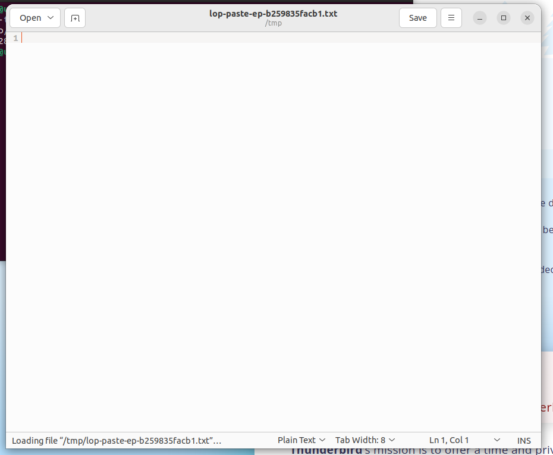
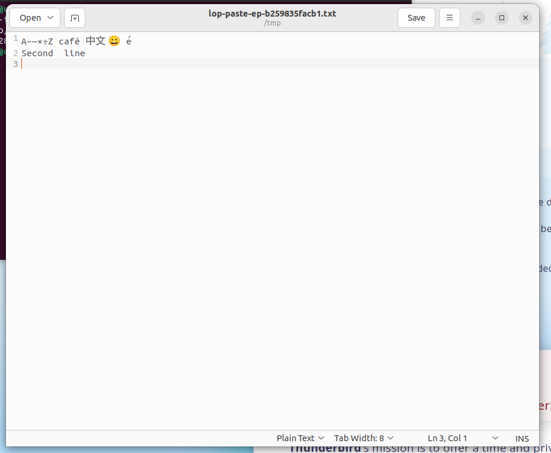
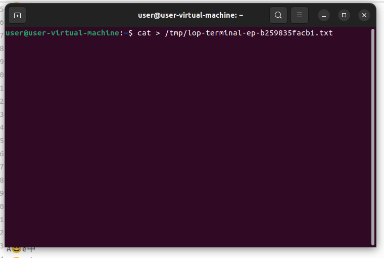
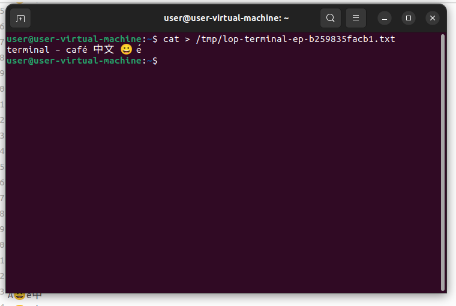
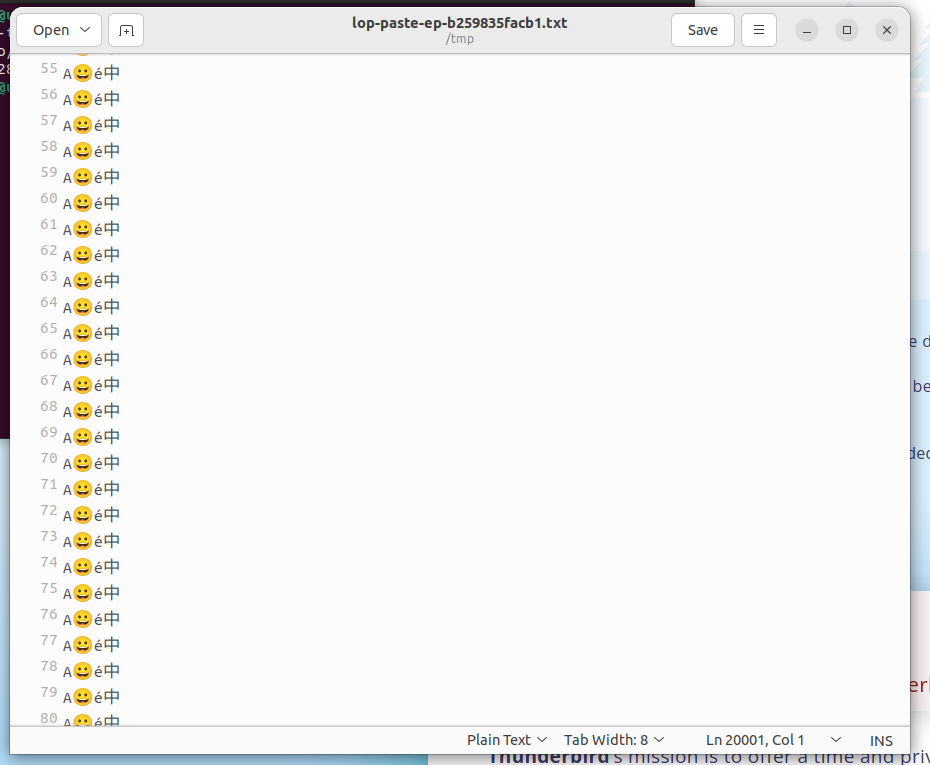

# PR #651: native Unicode paste validation

These are **synthetic apparatus checks, not OSWorld model scores**. No model
inference was invoked. The ordinary episode runner, negotiated adapter worker,
action compiler, guest transport, observations, evidence writer and cleanup path
were exercised using a programmed `EpisodeModelClient`.

## Pinned apparatus

- Source: `0aa8960cc95c5058ab61031b299e5dd7b5d5c00f`, stacked on #640.
- Non-editable private harness wheel SHA-256:
  `95e41054d072094a0da3c269ba62f36fc9d8bc550f5f0f927702bbb5ae63929b`.
- Adapter 0.1.2 wheel SHA-256:
  `60cfa0f1555652626a769a8c9aff0d736a47fc98767175978f7ce7048f07431c`.
- Adapter RPC 1.5, unchanged benchmark input release `osworld-v2-2026.08.08`.
- AWS `us-east-1`, `t3.xlarge`, AMI `ami-01017272139e01feb`.
- Native desktop frame geometry: 1920 × 1080 pixels. Gedit 41.0.
- Episode: `ep-b259835facb1`; ordinary task bootstrap only, no claim that its
  benchmark goal was completed. The synthetic reportability label excludes it
  from model evaluation results.

The private harness wheel retains development version metadata 0.46.22. It is
**not** asserted to be the published 0.46.22 artifact. Build from the pinned
source and bind wheel/package/workspace digests using the existing build and
selector utilities; do not rely on the version string alone.

## Procedure and oracle

The programmed client used only real protocol actions to manipulate applications:

1. Open a terminal with `CTRL+ALT+t`.
2. Through ordinary ASCII typing, create an empty temporary file and open it in
   Gedit. Assert fixture focus before entering text.
3. For this synthetic byte-oracle fixture only, set
   `org.gnome.gedit.preferences.editor ensure-trailing-newline` to `false`.
   The actual starting value was `true`; the changed value was independently
   read back as `false` before the first paste. No production input code changes
   editor settings.
4. Issue `paste_text` with explicit `keys: ["CTRL", "v"]` and
   `clipboard_policy: "overwrite"`, observe, then save in a separate action.
5. Independently retrieve the saved file through the guest file endpoint and
   compare its raw bytes with `payload.encode("utf-8")`. No stripping,
   normalization, or newline correction is applied to the result.
6. Select all and repeat for the 1,000- and 100,000-character payloads.
7. Open a terminal and run `cat > <temporary file>` through keyboard actions.
   Paste with explicit `CTRL+SHIFT+v`, send a separate `CTRL+d`, and independently
   compare the saved file bytes.

The payloads are reproducible without benchmark task data:

```python
small = "A–—×÷Z café 中文 😀 e\u0301\nSecond\tline\n"
thousand = (small * 100)[:1000]
maximum = "A😀é中\n" * 20000
terminal = "terminal – café 中文 😀 e\u0301\n"
```

The first run intentionally remains a failed experiment: Gedit's default
implicit-trailing-newline save policy produced exactly `payload + b"\n"`, although
all supplied Unicode was present. The repeat controls that application behavior
rather than modifying production paste or weakening the byte oracle.

## Results

| Surface | Input codepoints | Saved UTF-8 bytes | Exact | xclip processes after check |
| --- | ---: | ---: | --- | ---: |
| Editor, small | 32 | 47 | Yes | 1 |
| Editor, 1,000 | 1,000 | 1,471 | Yes | 1 |
| Editor, maximum | 100,000 | 220,000 | Yes | 1 |
| Terminal | 24 | 35 | Yes | 1 |

`checks.json` records raw-result hashes and the original frame hashes. The
retained evidence bundle independently verifies. The VM was terminated and the
post-run tagged-resource audit returned an empty list. AWS infrastructure usage
is separate from the zero model-inference usage.

## Rendered evidence

Images are explicitly cropped from the recorded native frames to remove unrelated
background applications. Crop rectangles, original hashes and published-image
hashes are in `checks.json`.

| Before | After |
| --- | --- |
|  |  |
|  |  |



## Limits

These checks establish the recorded editor/terminal paths, not every application,
clipboard manager, desktop platform, or failure timing. Fault cases additionally
have generated-subprocess tests; deliberately stalled GUI clients were not part
of this successful native run. This is not a claim of exhaustive native coverage. Rich-format clipboard restoration is deliberately unsupported;
`overwrite` is explicit. Application interpretation of pasted newlines is not a
promise of non-submission. Dispatch is not a task-completion guarantee.

An earlier capture experiment was confounded by Chrome covering its fixture.
A visibility-controlled heartbeat subsequently showed the actual benchmark
screenshot endpoint updating its rendered ASCII state. No production screenshot
backend change is included.
