```mermaid
graph TD
    %% Default Link Style for better contrast
    linkStyle default stroke:#606060,stroke-width:1.5px

    %% Node Styles
    classDef default fill:#1A2B3C,stroke:#1A2B3C,color:#FFFFFF; %% Dark blue fill, dark blue stroke, white text

    subgraph UserInteraction
        direction LR
        User[User Input] -- "Text/Commands" --> Operator["Operator (local_operator/operator.py)"]
    end

    subgraph CoreAIAgent
        direction LR
        Operator --> RequestClassifier["Classify Request"]
        RequestClassifier -- "Classification" --> PlanGenerator["Generate Plan"]
        PlanGenerator -- "Execution Plan" --> Executor["LocalCodeExecutor (local_operator/executor.py)"]
        Executor -- "LLM Calls" --> LLM_Interaction["LLM Interaction"]
        LLM_Interaction -- "Model Config" --> ModelConfig["ModelConfiguration (local_operator/model/configure.py)"]
        LLM_Interaction -- "System Prompts" --> PromptsPy["prompts.py"]
        Executor -- "Code/Actions" --> SafetyChecks["Safety Checks"]
        SafetyChecks -- "Audit Feedback" --> LLM_Interaction
        Executor -- "Updates" --> ConversationHistory["Conversation History"]
        Executor -- "Updates" --> ExecutionHistory["Execution History"]
        Executor -- "Manages" --> AgentState["AgentState"]
        AgentState -- "Stores" --> AgentRegistry["AgentRegistry (local_operator/agents/)"]
        ConversationHistory -- "Part of" --> AgentState
        ExecutionHistory -- "Part of" --> AgentState
        AgentState -- "Stores" --> Learnings["Learnings"]
    end

    subgraph ToolingIntegrations
        direction LR
        Executor -- "Uses" --> ToolRegistry["ToolRegistry (local_operator/tools/general.py)"]
        ToolRegistry -- "Provides" --> GeneralTools["General Tools"]
        ToolRegistry -- "Provides" --> GoogleTools["Google Tools (local_operator/tools/google.py)"]
        ToolRegistry -- "Manages" --> CredentialManager["CredentialManager (local_operator/credentials.py)"]
        ToolRegistry -- "Interacts" --> SchedulerService["Scheduler Service"]

        GeneralTools -- "Browse" --> WebBrowsing["Web Browsing"]
        WebBrowsing -- "Uses" --> Playwright["Playwright"]
        GeneralTools -- "Generate" --> ImageGeneration["Image Generation"]
        ImageGeneration -- "Uses" --> RadientClient["RadientClient (local_operator/clients/radient.py)"]
        ImageGeneration -- "Uses" --> FalClient["FalClient (local_operator/clients/fal.py)"]
        GeneralTools -- "Search" --> Search["Web Search"]
        Search -- "Uses" --> RadientClient
        Search -- "Uses" --> SerpApiClient["SerpApiClient (local_operator/clients/serpapi.py)"]
        Search -- "Uses" --> TavilyClient["TavilyClient (local_operator/clients/tavily.py)"]
        GeneralTools -- "Send" --> Email["Email Sending"]
        Email -- "Uses" --> RadientClient
        GeneralTools -- "Automate" --> BrowserAutomation["Browser Automation"]
        BrowserAutomation -- "Uses" --> BrowserUse["browser-use library"]

        GoogleTools -- "Accesses" --> Gmail["Gmail API"]
        GoogleTools -- "Accesses" --> Calendar["Calendar API"]
        GoogleTools -- "Accesses" --> Drive["Drive API"]
        GoogleTools -- "Uses" --> GoogleClient["GoogleClient (local_operator/clients/google_client.py)"]

        RadientClient -- "API Calls" --> RadientAPI["Radient API"]
        FalClient -- "API Calls" --> FalAPI["FAL API"]
        SerpApiClient -- "API Calls" --> SerpAPI["SERP API"]
        TavilyClient -- "API Calls" --> TavilyAPI["Tavily API"]
        GoogleClient -- "API Calls" --> GoogleAPIs["Google APIs"]
    end

    subgraph DataPersistence
        AgentRegistry -- "Stores" --> AgentData["Agent Data"]
        AgentData -- "Includes" --> ConversationHistory
        AgentData -- "Includes" --> ExecutionHistory
        AgentData -- "Includes" --> Learnings
        AgentData -- "Includes" --> Schedules["Schedules"]
    end

    subgraph ExecutionEnvironment
        Executor -- "Runs in" --> PythonEnvironment["Python Execution Environment"]
        PythonEnvironment -- "Accesses" --> Filesystem["Local Filesystem"]
        PythonEnvironment -- "Captures" --> StdoutStderr["Stdout/Stderr Capture"]
    end

    subgraph PromptGeneration
        PromptsPy -- "Generates" --> SystemDetails["System Details"]
        PromptsPy -- "Generates" --> InstalledPackages["Installed Python Packages"]
        PromptsPy -- "Generates" --> ToolDescriptions["Tool Descriptions"]
        PromptsPy -- "Generates" --> SpecializedInstructions["Specialized Instructions"]
        SystemDetails --> LLM_Interaction
        InstalledPackages --> LLM_Interaction
        ToolDescriptions --> LLM_Interaction
        SpecializedInstructions --> LLM_Interaction
    end

    %% Connections (These remain the same)
    User --> Operator
    Operator --> RequestClassifier
    RequestClassifier --> PlanGenerator
    PlanGenerator --> Executor
    Executor --> LLM_Interaction
    Executor --> SafetyChecks
    Executor --> ConversationHistory
    Executor --> ExecutionHistory
    Executor --> AgentState
    Executor --> ToolRegistry

    ToolRegistry --> GeneralTools
    ToolRegistry --> GoogleTools
    ToolRegistry --> CredentialManager
    ToolRegistry --> SchedulerService

    GeneralTools --> WebBrowsing
    GeneralTools --> ImageGeneration
    GeneralTools --> Search
    GeneralTools --> Email
    GeneralTools --> BrowserAutomation

    ImageGeneration --> RadientClient
    ImageGeneration --> FalClient
    Search --> RadientClient
    Search --> SerpApiClient
    Search --> TavilyClient
    Email --> RadientClient
    BrowserAutomation --> BrowserUse

    GoogleTools --> Gmail
    GoogleTools --> Calendar
    GoogleTools --> Drive
    GoogleTools --> GoogleClient

    RadientClient --> RadientAPI
    FalClient --> FalAPI
    SerpApiClient --> SerpAPI
    TavilyClient --> TavilyAPI
    GoogleClient --> GoogleAPIs

    AgentState --> AgentRegistry
    AgentRegistry --> AgentData
    AgentData --> ConversationHistory
    AgentData --> ExecutionHistory
    AgentData --> Learnings
    AgentData --> Schedules

    Executor --> PythonEnvironment
    PythonEnvironment --> Filesystem
    PythonEnvironment --> StdoutStderr

    LLM_Interaction --> ModelConfig
    LLM_Interaction --> PromptsPy

    %% Styles for subgraphs (Updated for subtlety and contrast)
    style UserInteraction fill:#F0F8FF,stroke:#AEC6CF,stroke-width:3px
    style CoreAIAgent fill:#F0FFF0,stroke:#A7D7A7,stroke-width:3px
    style ToolingIntegrations fill:#FFF8DC,stroke:#F0E68C,stroke-width:3px
    style DataPersistence fill:#FFF0F5,stroke:#D8BFD8,stroke-width:3px
    style ExecutionEnvironment fill:#FAFAFA,stroke:#E0E0E0,stroke-width:3px
    style PromptGeneration fill:#FFFFE0,stroke:#FAFAD2,stroke-width:3px
```

# Dependency Graph

Local Operator is built with a modular architecture that separates concerns into distinct components. The Mermaid diagram below illustrates the key components and their relationships:

- **CLI Domain**: The command line interface for user interaction
- **Configuration Domain**: Manages configuration settings and API credentials
- **Execution Domain**: Handles code execution, safety, and console output
- **Modeling Domain**: Defines language models, data types, and prompt engineering
- **Agent Management Domain**: Coordinates AI agents and admin tools
- **Tooling Domain**: Integrates with external tools and services
- **API Domain**: Provides a FastAPI server interface
- **External Tools**: Third-party integrations like web browsing and search

The arrows indicate dependencies and data flow between components. Key relationships include:

- The CLI interfaces with configuration and manages agents
- The executor orchestrates model configuration, tool integration, and agent management
- The operator coordinates execution while managing configuration, credentials and types
- The API server provides a REST interface to core functionality
- External tools are integrated through the tooling layer

The following was generated with ❤️ by Local Operator for humans 🤝

