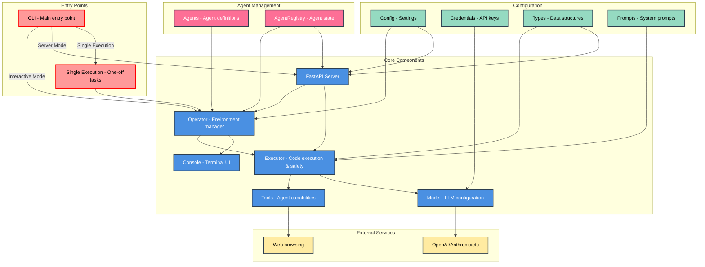

# Dependency Graph

Local Operator is built with a modular architecture that separates concerns into distinct components. The Mermaid diagram below illustrates the key components and their relationships:

- **CLI Interface**: The entry point and user interaction layer
- **Core Components**: The main business logic and execution engine
- **Configuration & State**: Settings, credentials and shared types
- **Agent Management**: Handles creation and coordination of AI agents
- **External Services**: Third-party integrations like LLM providers

The arrows indicate dependencies and data flow between components.

