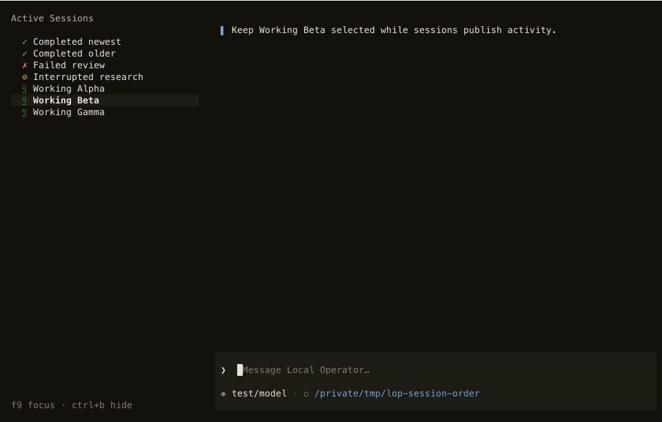

# Stable session category / creation ordering

Standard C1 bug fix. No version bump, no acknowledgement or retention-policy change.

## Delivery contract

Within the existing Active/Previous sections, list priorities are:

1. A pending human decision (existing priority, preserved).
2. Completed but unviewed.
3. Unviewed error.
4. Unviewed interruption.
5. Work in progress.
6. Ordinary idle/attached sessions, then viewed cold history.

Every category orders by descending immutable conversation creation timestamp,
then ascending immutable session ID. Transcript activity, heartbeat, owner start,
name, and input iteration order never break ties. A busy/wedged session suppresses
its stale unread outcome, matching existing status glyph semantics. A wedged
runtime is not a completed-error receipt. Active/Previous membership stays as it
was; its definition no longer depends on how many priority categories exist.
Mobile's existing section split and history cap are unchanged. `/resume` retains
its existing activity ordering and one-read-per-row cost contract.

Creation authority: write-once `created_at.json` at eager transcript materialization,
first deferred write, or fork creation. A fork gets its own date, not the first
inherited journal entry. Reopening/compacting/appending does not overwrite it;
a transcript remembers its date for directory self-healing. Concurrent writers
publish via an atomic no-clobber hard link. Legacy fallback is valid fork
provenance, directory birth time where available, then zero. No reader initializes
an unknown date to now, mtime, heartbeat or process start. Corrupt/read-only
metadata degrades to the same immutable fallback.

## Actual execution evidence

### TUI: real OperatorApp, stylesheet, durable catalog loader

`before/` is base `c26aa8314`; `after/` is the implementation. Each contains four
consecutive activity-refresh SVGs, their PNG rasterizations, geometry and ordering
JSON. Captured with `scripts/session_order_shot.py`; `rsvg-convert` rasterizes the
SVG and the PNGs were actually viewed. Synthetic runtime states are applied to
rows read through the production `cached_session_rows` loader; the app is the
real `OperatorApp`, not a stylesheet-free test host. No model call is claimed.

```sh
PYTHONPATH=. .venv/bin/python scripts/session_order_shot.py /tmp/order-frames
rsvg-convert /tmp/order-frames/tui-1.svg -o /tmp/order-frames/tui-1.png
```

| Frame | Before busy order | After busy order | Cursor identity |
|---|---|---|---|
| 0 | Alpha, Beta, Gamma | Alpha, Beta, Gamma | busy-b |
| 1, Gamma activity | Gamma, Alpha, Beta | Alpha, Beta, Gamma | busy-b |
| 2, Alpha activity | Alpha, Gamma, Beta | Alpha, Beta, Gamma | busy-b |
| 3, Beta activity | Beta, Alpha, Gamma | Alpha, Beta, Gamma | busy-b |

Both use 120×36 cells, native 960×612 pixels. Selected Beta moves vertically in
the before refreshes, but stays on its original row after. Geometry sidecars
record actual content/virtual sizes and styles. The independent click regression
also refreshes repeatedly then clicks the original coordinate, asserting `busy-b`
was selected; equal creation timestamps are explicitly covered in both sort paths.




### Mobile: real daemon, summary API and built React app

Run the fixture with a free loopback port (default 4198):

```sh
PYTHONPATH=. .venv/bin/python scripts/session_order_mobile.py 4199
# Visit http://127.0.0.1:4199, synthetic password: ordering-demo
curl -X POST http://127.0.0.1:4199/fixture/tick
```

The fixture creates isolated synthetic durable sessions and live projections. It
serves the real mobile application without scanning/dialing real registrants.
`/fixture/tick` changes transcript mtime and record heartbeats and emits the real
session-list refresh notification. Restart the fixture to reset unread receipts.
Both scripts isolate HOME/config and remove every inherited CMUX_* variable.

`mobile-order.json` records five real HTTP refreshes on the baseline and fix:
baseline busy rows rotate and outrank completions; after, every response is
`done-new, done-old, error, interrupt, busy-a, busy-b, busy-c`.
`mobile-api.json` records the real authenticated list response and checks:

| Request | Actual status |
|---|---|
| Unauthenticated list | 401 |
| Synthetic login and authenticated list | 200 |
| Wrong-origin mutation | 403 |
| Acknowledgement without required completion token | 422 |

**Browser evidence blocked, not waived:** the browser tool refused to open with
“already driving 8 tabs”; none belongs to this task. The parent coordinated with
peers and found orphaned tabs with no supported close/adopt operation. No alternate
browser engine was launched. There are no mobile browser screenshots or claimed
real-browser tap/geometry checks. React's actual list DOM is tested for retained
card identity, focus and tap destination across eight activity rerenders, but
that does not replace the pending browser/design/UX validation. Do not merge until
those independent review gates can be satisfied.
