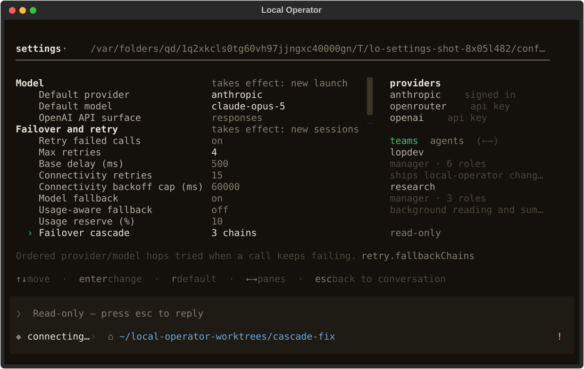
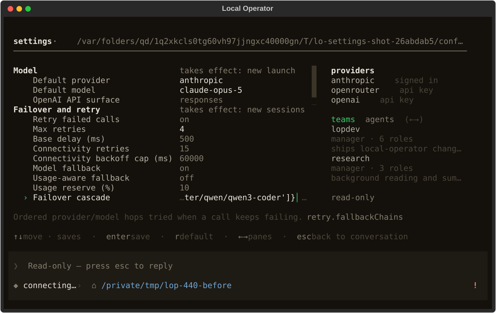
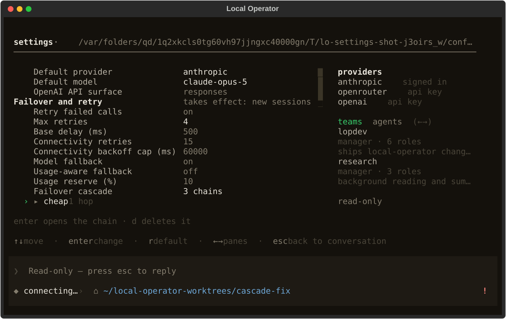
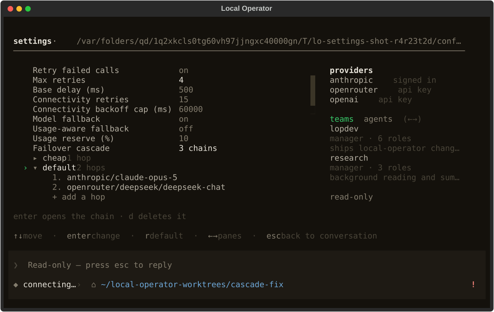

# `enter` on the failover cascade row — rendered evidence

Frames for #440: pressing `enter` on the **failover cascade** row
(`retry.fallbackChains`) in `/settings` destroyed the user's entire cascade.
`action_activate` had no `Kind.CASCADE` branch, so the row fell through to
`_begin_edit`, which opens a free-text editor seeded with `str(dict)` — a
Python repr. Accepting it stored that repr as a **string**, `read_chains` then
returned `{}`, and `r` could not restore it because the stored value was no
longer a mapping.

Captured with `scripts/settings_shot.py`, which drives the real `OperatorApp`
(the only host that loads `local_operator.tcss`) against a scratch config dir
seeded with three real chains.

The `cascade-row` state is the one this fix added, and it exists because no
existing frame could show the bug: the `cascade` state selects a **chain** row
and activates that, which has always worked. The bug is one row above it, on
the SETTING row that owns the chains, and nothing photographed it.

Reproduce either side:

```sh
# the row at rest (OUT.svg) and activated (OUT.open.svg)
env -u NO_COLOR TERM=xterm-256color .venv/bin/python \
    scripts/settings_shot.py OUT.svg 100x30 cascade-row
# the cascade's own editor, which this fix routes `enter` into
env -u NO_COLOR TERM=xterm-256color .venv/bin/python \
    scripts/settings_shot.py OUT.svg 100x30 cascade
```

The stored-value half of the reproduction — the part the pixels cannot show —
is `scripts/cascade_repro.py`, which drives a real `enter` through the app's
own binding and prints `retry.fallbackChains` before and after.

## The row at rest — unchanged

Both frames read `Failover cascade   3 chains`. The fix does not touch how the
row paints; it changes what activating it does, which is why a still of the
resting row alone would not show it.

| before | after |
|---|---|
|  |  |

## The row activated — the bug and the fix

| before — `enter` pressed | after — `enter` pressed |
|---|---|
|  |  |

The before-frame is the bug: an inline text editor is open **on the cascade
row**, holding the tail of the mapping's Python repr
(`…ter/qwen/qwen3-coder']}`) with a caret after it, and the footer has switched
to the editor's contract (`↑↓ move · saves · enter save`) — so the very next
`enter`, or any arrow key, commits that repr over the cascade. The value column
that read `3 chains` a keypress ago now reads as editable text.

The after-frame has no editor. The cursor has travelled into the cascade's own
group and sits on the first chain (`› ▸ cheap  1 hop`), the detail line reads
`enter opens the chain · d deletes it`, and the footer keeps the page's normal
contract (`enter change`). `Failover cascade` still reads `3 chains`.

## The cascade's own editor still works



`enter` on a chain expands it into its ordered hops and its `+ add a hop` row,
unchanged by this fix. The full walk — open a chain, add, reorder and delete a
hop, `esc` back out, delete a whole chain behind its confirmation, add a chain —
is in the PR body with the stored cascade printed after every step.

## The numbers behind the frames

`scripts/settings_shot.py` prints its geometry with every capture. Nothing
about the page's layout moves; only the footer contract differs, which is the
point:

```
before  cascade-row  rows=62  body.size=(62, 14)  hints='↑↓ move · saves · enter save · r default · ←→ panes · esc back to conversation'
after   cascade-row  rows=62  body.size=(62, 14)  hints='↑↓ move · enter change · r default · ←→ panes · esc back to conversation'
```

The `saves` clause in the before-line is the editor state the page should never
have been in on this row: it is the footer telling the user that moving off the
row will store what is in the buffer.
