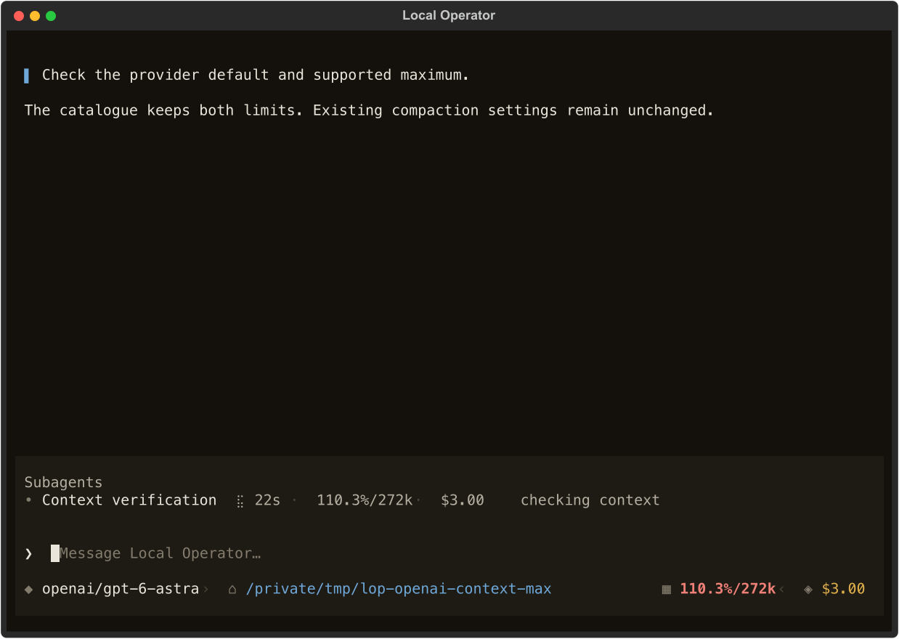
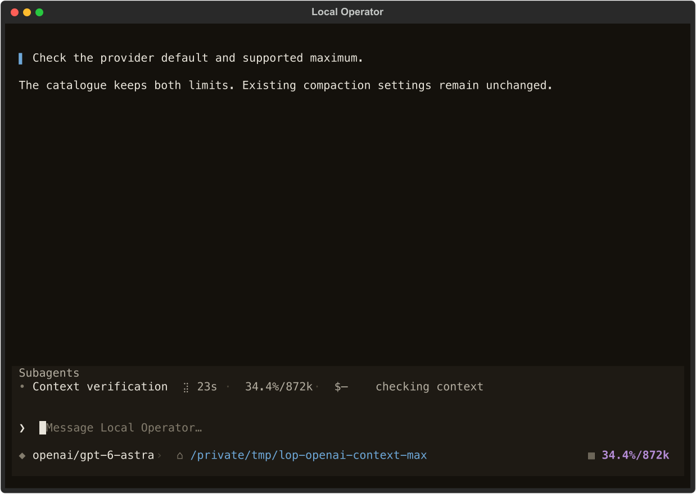
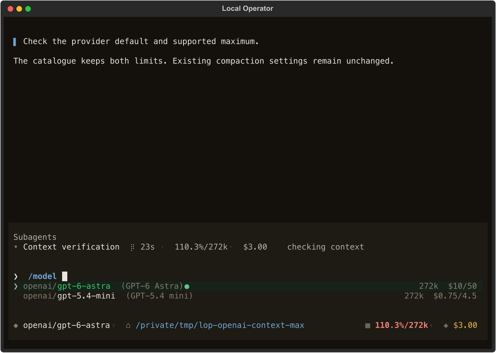
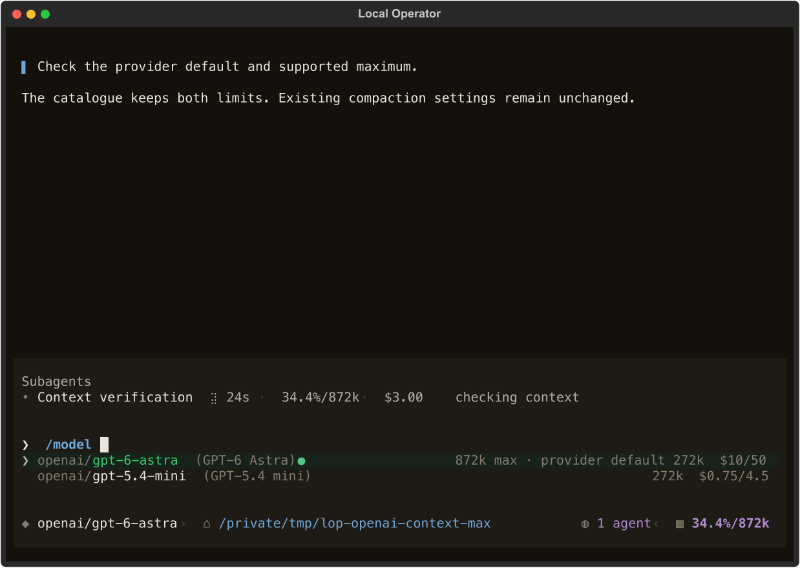
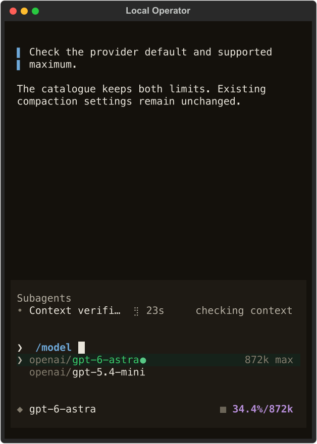
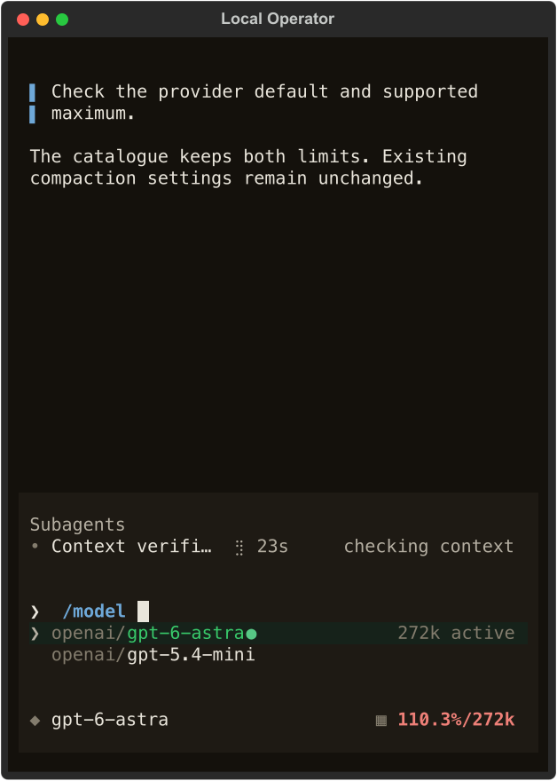
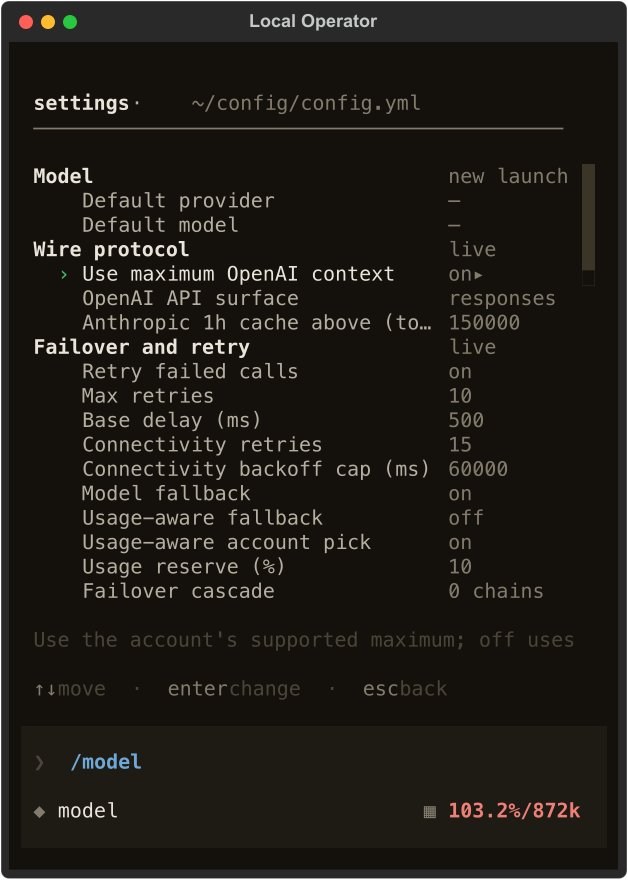
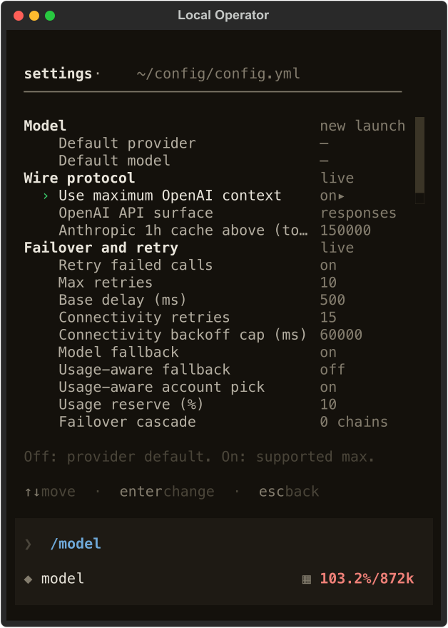
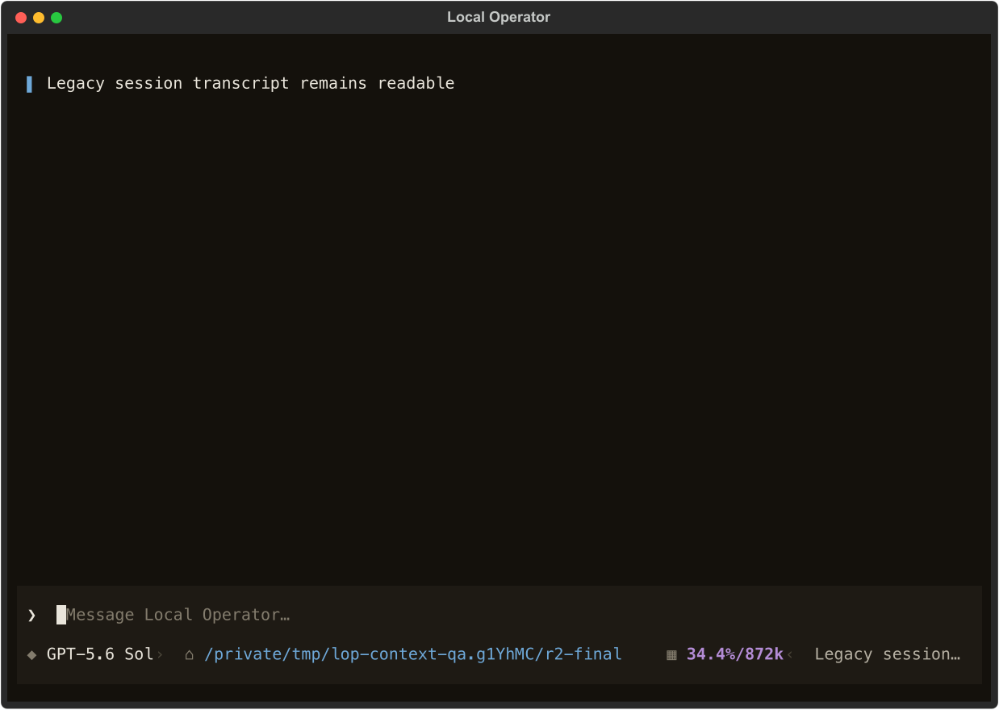
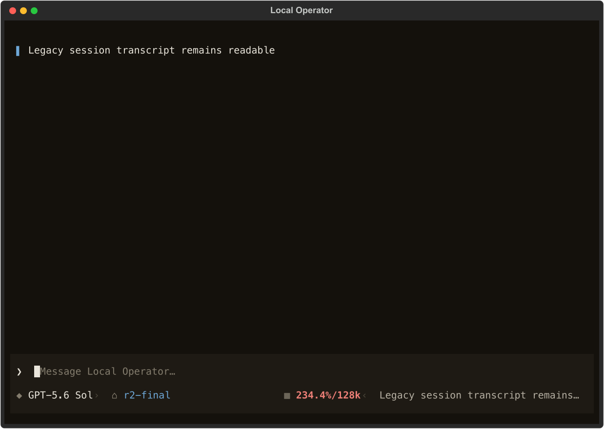

# OpenAI active context verification

## Contract

Use the selected ChatGPT account's supported maximum as the active context
window, preserving its provider default separately. Keep API-key limits and all
compaction settings independent. Publish account-rotation metadata through the
request's own stream so parent and child usage do not share a mutable callback.

## Reproduction

Run from the repository root with its own editable environment:

```sh
.venv/bin/python docs/verification/openai-context-http.py.txt
env -u NO_COLOR HOME=<isolated-home> LOCAL_OPERATOR_CONFIG_DIR=<isolated-home>/.local-operator \
  TERM=xterm-256color .venv/bin/python docs/verification/openai-context-shot.py.txt \
  <output-dir> 100 872000
rsvg-convert <output-dir>/picker.svg -o <output-dir>/picker.png
```

The HTTP script creates its own isolated home. For the visual pair, run again
at width 50, and with `CONTEXT_BASELINE=1`/window 272000 for the original picker;
window 272000 without baseline mode captures the opt-out state. All screenshots
are fixtures on the real application, not actual paid provider conversations.

## Executed local HTTP path

A task-owned `ThreadingHTTPServer` served `/models` and Codex-shaped `/responses`.
The candidate's real `AuthStore`, `SessionStreamFn`, `Session`, discovery/cache,
HTTP wire client, event loop and frontend projection were exercised. Only the
remote provider was replaced; the local account used a fabricated test token.
A fresh isolated `HOME` prevented reads of the operator's config or caches.

```
$ HOME=<isolated-home> LOCAL_OPERATOR_CONFIG_DIR=<isolated-home>/.local-operator \
  .venv/bin/python <evidence-dir>/real_path.py
GET /models: 200, account=local-account
POST /responses: 200, model=gpt-6-astra, account=local-account
max_context_window wire flag: absent
active=872000, default=272000, maximum=872000
300000 input tokens: 34.4%/872k
compaction trigger with explicit 0.8/400000: 400000
local fixture: missing authorization 401, wrong account 403, invalid model 400
```

The HTTP fixture reports 300,000 input tokens for a short request. This proves
accounting and propagation above the old default, **not** acceptance of a
300,000-token real provider request. No huge paid generation was performed.

The coordinating agent separately exercised the candidate resolver against the
real authenticated production catalogue with isolated cache storage and no
inference. Results: Astra and the 5.6 Sol/Terra/Luna variants active/max 872,000,
default 272,000; 5.5 and mini 272,000; Spark 128,000. The explicit 400,000 trigger
remained 400,000 for the 872,000-window models.

## Rendered evidence

| Surface | Before | After |
| --- | --- | --- |
| Composer and child |  |  |
| Picker |  |  |
| Narrow picker |  |  |

Real `OperatorApp.run_test`, loading the application's stylesheet, at 100x34 and
50x34. SVG exports were rendered with the installed `rsvg-convert` and the PNGs
were viewed. Populated transcript, composer, child-job usage, model picker,
changed selection and settled consecutive frames were captured.

- Baseline composer and child: `110.3%/272k` at 300,000 tokens.
- Candidate composer and child: `34.4%/872k`.
- Wide picker: `872k max · provider default 272k`.
- Narrow picker: `872k max` remains while prices drop.
- Opt-out: wide provider-default-active label; narrow `272k active`.
- Equal-limit mini retains its ordinary single 272k label.
- No percentage clamp: genuine overflows remain above 100%.
- Picker content/virtual dimensions stayed 96x3 (wide), 46x3 (narrow), with no
  scrollbar, through settled frames and selection changes.

The negative HTTP statuses above validate the local fixture's failure paths;
provider failover/rotation behavior is separately exercised by regression tests.
They are not represented as real OpenAI authorization responses.

Original pre-edit captures are retained. Matched seeded baseline frames use the
original picker row methods from the base commit in the same app host; no user
work was stashed or overwritten. Fixture prices are representative, not billing
verification. Long-context pricing and surcharges are outside this change.

## Initial review gate results

On the integrated `5a4079bc` source (feature plus main `619ec60a`): full-tree
flake8, Black 26.1.0, isort 5.13.2 and pyright passed (zero type errors).
The full unit suite reported **12,987 passed, 15 skipped, one failure** in
902 seconds. The failure was the recently merged, unchanged
`test_subagent_view::test_a_narrow_viewport_opens_on_a_row_head_not_a_wrap_fragment`:
landing offset 28 versus owner top 25. An isolated rerun passed (8.20 seconds);
the coordinator independently reran it successfully. This is not represented as
a fully green unit gate; final CI/remediation gates must settle it.

Earlier full-suite failures exposed two ambient runtime flags inherited when
tests run inside a detached operator. The existing fixture now clears
`LOP_RUNTIME_ADOPT_SESSION` and `LOP_RUNTIME_DEFER_MATERIALISE`; all 18 strict
resume tests passed with the fix. No application resume contract was changed to
make those tests pass. The effort fixture also isolates cwd so the checkout name
`context-max` cannot masquerade as an effort label in the status-band assertion.

## Unified review remediation

- **F1:** resolve every selected OpenAI API route, even if the previous OAuth
  result was unknown and had no positive default/max. Regression exercises
  public 1,050,000 → unavailable OAuth 128,000 → API 1,050,000.
- **F2:** `ModelSpec.context_metadata_resolved` explicitly marks fresh route
  resolution, including unknown and missing-auth results. The marker survives
  request events and frontend JSON snapshots. Cold resume cannot overwrite it
  from a legacy checkpoint. Tests cover offline, missing account and missing
  auth against a legacy 1,050,000-token checkpoint.
- **Q1:** the cold viewer owns the complete AuthStore lifetime on one worker:
  creation, asynchronous credential resolution on that worker's event loop,
  SQLite reads, metadata resolution and close. Separate `to_thread` calls no
  longer depend on worker reuse. The regression warms four executor workers and
  checks actual SQLite reads and close occur on the creation thread.
- **D1:** front-loaded the existing help string; both on/off outcomes are
  visible at 50 columns without changing the settings widget. The next-request
  and unchanged-compaction explanation follows at wider widths.
- Integrated main `3b100234` (#628). Only the project version conflicted;
  retained reserved 0.46.15. Verified request metadata events coexist with the
  new replay-prefix preparation path and session snapshot/event folding.

| Settings help before | Settings help after |
| --- | --- |
|  |  |

Settings before/after screen and virtual size are both 48×32, no screen
scrollbar; settings region 48×27 and virtual content 46×25 are unchanged.
The tracked local HTTP harness was rerun after integration: catalogue GET200,
Codex POST200, 34.4%/872k, explicit 400k trigger, no maximum wire flag.
Independent remediation QA executed 20 successful observations with actual
loopback HTTP, persisted legacy checkpoints, real AuthStore and repeated
`RemoteSession.cold` calls after an assembled app warmed the executor. The
online cold composer remains 34.4%/872k; offline/missing-account/missing-auth
legacy 1,050,000-token checkpoints retain the fresh conservative 128,000 limit.
The resulting 234.4% reading is intentionally not clamped. Both PNGs were viewed.

| Online cold resume | Offline cold resume |
| --- | --- |
|  |  |

## Remediation gate results

The full unit gate integrating main `3b100234` and the unified context
remediation completed with **13,109 passed, 15 skipped** in 1204.62 seconds.
Q1 was discovered while that run was in flight: its final thread-ownership
delta was additionally validated by 32 focused context/remote tests and the
independent repeated-cold-view HTTP/app sequence (20 passing observations).
Full-tree flake8, Black, isort and pyright passed after Q1.

Then integrated `a517f229` (#632): the only production delta is the GPT-6
reasoning-effort policy in `model/effort.py`; context resolution continues to
preserve effort fields and provider-listing precedence. Version advanced to
0.46.18 to avoid downgrading the concurrently released 0.46.17. The final
narrow integration is covered by the effort/session/context/remote matrix and
E2E rather than claiming the earlier full-unit run includes later source.
The final focused matrix passed **191 tests** in 7.41 seconds; E2E passed
**9 tests** in 18.43 seconds. The installed candidate reports version 0.46.18
and imports from its own worktree. Its tracked HTTP reproduction was rerun
successfully after this integration.

## Regression coverage

`tests/unit/model/test_openai_context.py` covers default/max parsing and cache
round trips, invalid maxima, complete public registry bypass for OAuth,
account-scoped memoization/token refresh, account rotation including replayable
calls, API-key separation, missing-account/offline fallback, opt-out/default
behavior, session/frontend adoption, primary recovery, cold resume, current-row
metadata, child statistics, unchanged compaction threshold and overflow display.
Settings consumer-default and live-configuration tests include the new key.
